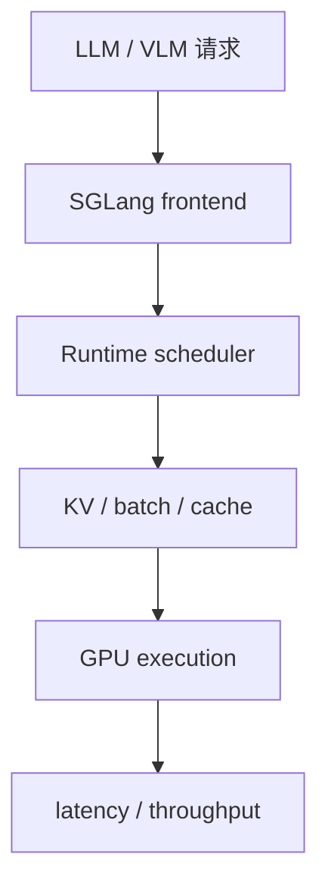
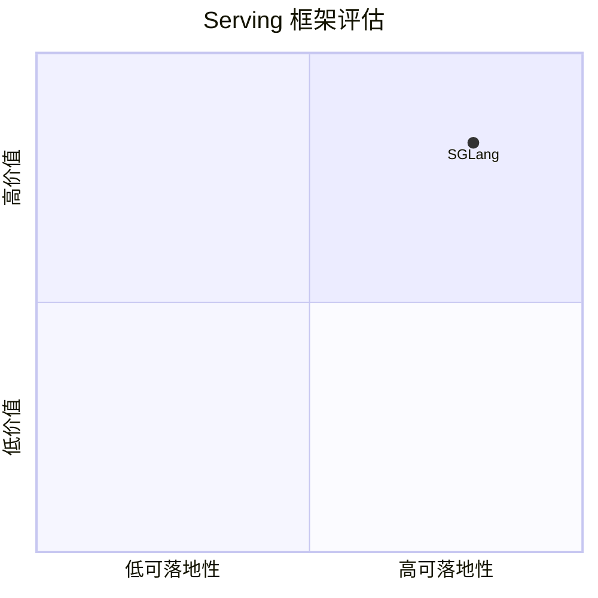

# sgl-project-sglang

> 类型：GitHub 详情页
> 创建日期：2026-09-17
> 原文链接：https://github.com/sgl-project/sglang
> 返回日报：[[Daily/2026-09-17]]

## 一句话结论

SGLang 是 high-performance serving 框架，适合与 vLLM、TensorRT-LLM 对比调度、吞吐和多模态 serving 能力。

## 信息压缩图示

## 相关链接

- 原文：https://github.com/sgl-project/sglang
