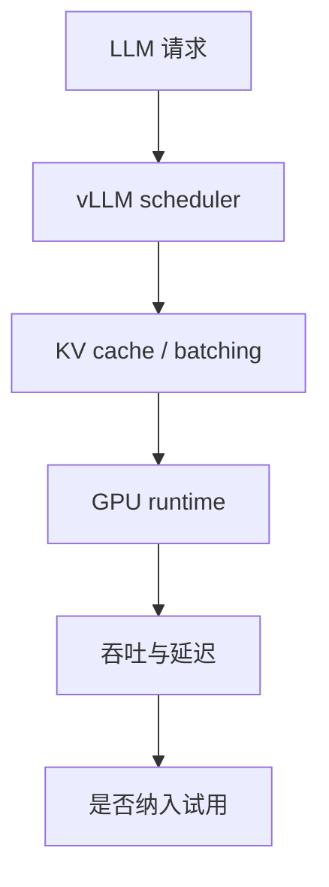
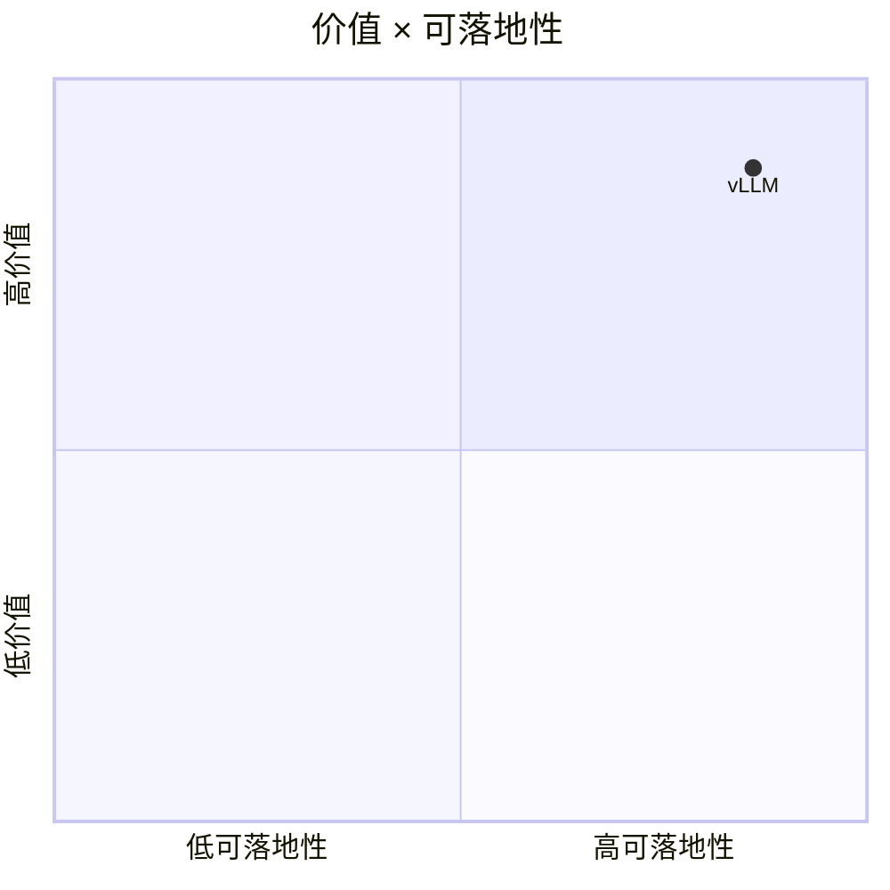

# vllm-project-vllm

> 类型：GitHub 详情页
> 创建日期：2026-09-17
> 原文链接：https://github.com/vllm-project/vllm
> 返回日报：[[Daily/2026-09-17]]

## 一句话结论

vLLM 是今日 AI Infra watched fallback 榜单中的核心 LLM serving 项目，适合继续作为吞吐、KV cache、scheduler 和多模型服务的基准观察对象。

## 信息压缩图示

## 对我的影响

| 维度 | 影响 | 建议动作 |
|---|---|---|
| AI Infra | Serving 基线项目 | 关注 release 与 benchmark |
| LLM 工程 | 影响部署成本和吞吐 | 与 SGLang/TensorRT-LLM 对比 |

## 相关链接

- 原文：https://github.com/vllm-project/vllm
