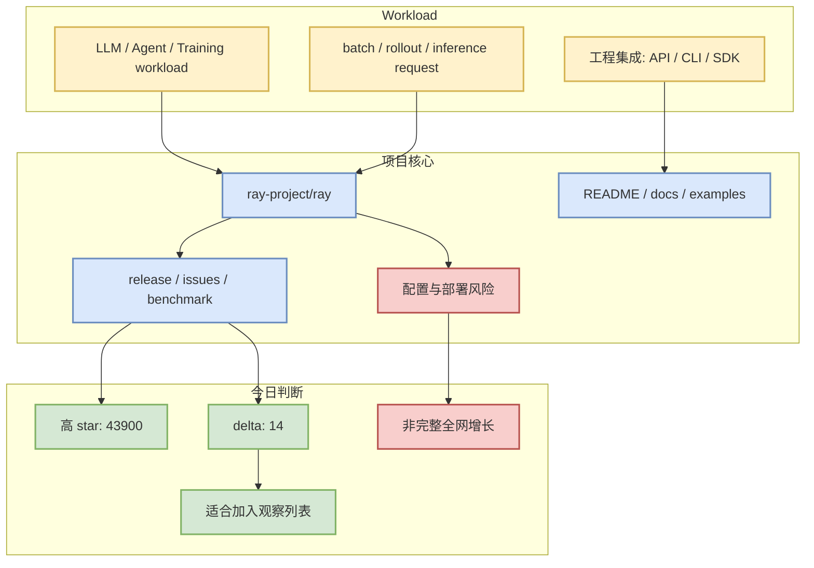

# ray-project/ray

> 日期：2026-09-23  
> 来源类型：GitHub Repository / direct watched repo fallback  
> 原文：https://github.com/ray-project/ray

## 一句话结论
ray-project/ray 是今日 AI Infra 固定观察集里的高信号项目；在 GitHub Search rate limit 下，使用 direct `/repos` 元数据保持续报。

## TL;DR
- stars：43900；forks：8070；language：Python。
- updated_at：2026-09-23T00:46:57Z。
- topics：data-science, deep-learning, deployment, distributed, hyperparameter-optimization, hyperparameter-search, large-language-models, llm, llm-inference, llm-serving, machine-learning, optimization, parallel, python, pytorch, ray, reinforcement-learning, rllib, serving, tensorflow。
- 增长依据：direct watched repo fallback，非完整全网日增；baseline=github-stars-2026-09-22.json；stars_delta=14。

## 元信息表
| 字段 | 值 |
|---|---|
| repo | `ray-project/ray` |
| 来源类型 | GitHub Repository |
| 原文链接 | https://github.com/ray-project/ray |
| 描述 | Ray is an AI compute engine. Ray consists of a core distributed runtime and a set of AI Libraries for accelerating ML workloads. |
| 是否值得试用 | 值得：需结合 README / release / benchmark 复核 |

## 信息压缩图示

## 专业解读
从 AI Infra / LLM 工程角度，今日不把该项目的增长解释为全网真实日增；它是 fixed watched repo fallback 的代表，用来维持 serving、training、agent loop 的连续观察。若项目涉及 scheduler、KV cache、runtime、RL rollout、tool calling 或 coding-agent loop，应优先检查最近 release 与 benchmark。

## 通俗解释
今天 GitHub 搜索额度不足，无法完整扫全网；所以先看一组长期关注的核心项目。这个项目的 star、更新时间和主题可以帮助判断它是否仍活跃、是否值得今天点进去看更新。

## 关键机制拆解
| 维度 | 观察点 | 今日判断 |
|---|---|---|
| 活跃度 | updated_at / pushed_at | 2026-09-23T00:46:57Z / 2026-09-23T00:25:47Z |
| 生态位置 | topics / language | data-science, deep-learning, deployment, distributed, hyperparameter-optimization, hyperparameter-search, large-languag… |
| 工程价值 | docs / examples / benchmark | 需进一步阅读 README 与 release |
| 风险 | rate limit / fallback | 非完整全网榜单，只作连续观察 |

## 对我的影响
- Serving/training 项目：优先看是否影响 vLLM/SGLang/TensorRT-LLM/DeepSpeed/verL/OpenRLHF 选型。
- Coding-agent 项目：优先看 agent loop、MCP、权限模式、上下文窗口、IDE/CLI 体验。
- Rummy/Game AI 项目：优先看状态表示、规则引擎、rollout/evaluator 是否可复用。

## 可信度与局限性
- 可信度：中；GitHub direct repo metadata 可验证。
- 局限：不是 GitHub Search 全网结果；增长不代表完整全网日增。

## 我应该如何跟进
1. 打开原文检查 README、release notes、benchmark。
2. 若涉及当前 AI Infra 栈，记录部署成本和最小复现实验。
3. 若涉及 coding workflow，和 Claude Code/Codex/Roo/Cline/Continue 的 agent loop 对比。

## 相关链接
- 原文：https://github.com/ray-project/ray
- 日报：[[Daily/2026-09-23]]

#ai-radar #github #ai-infra
