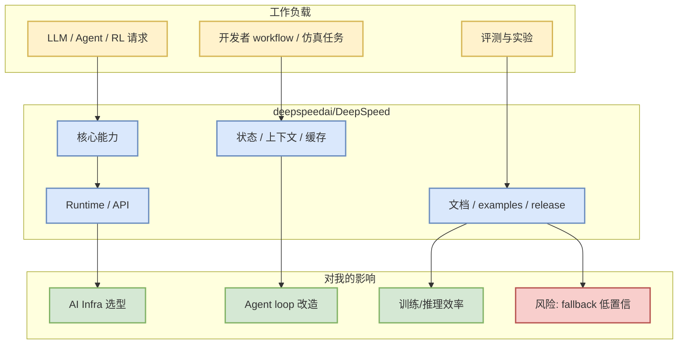

# deepspeedai/DeepSpeed

> 日期：2026-09-24  
> 类型：GitHub / Training / Post-training / Distributed Runtime  
> 原文：https://github.com/deepspeedai/DeepSpeed

## 一句话结论
deepspeedai/DeepSpeed 今日作为 `Training / Post-training / Distributed Runtime` 固定观察项进入 AI Radar；由于 GitHub Search 403，本页来自 direct watched repo fallback，增长不代表完整全网日增。

## TL;DR
- stars / forks：43156 / 5001
- language：Python
- updated_at：2026-09-23T21:04:36Z
- topics：billion-parameters, compression, data-parallelism, deep-learning, gpu, inference, machine-learning, mixture-of-experts, model-parallelism, pipeline-parallelism, pytorch, trillion-parameters, zero
- description：DeepSpeed is a deep learning optimization library that makes distributed training and inference easy, efficient, and effective.

## 元信息表
| 字段 | 内容 |
|---|---|
| repo | `deepspeedai/DeepSpeed` |
| 来源类型 | GitHub direct repo fallback |
| stars_delta | 0 |
| 增长依据 | direct watched repo fallback，非完整全网日增；baseline=github-stars-2026-09-23.json |
| 原文 | https://github.com/deepspeedai/DeepSpeed |

## 信息压缩图示

## 机制 / 影响矩阵
| 维度 | 判断 | 跟进动作 |
|---|---|---|
| AI Infra 相关性 | Training / Post-training / Distributed Runtime | 阅读 README / release / benchmark |
| 生产可用性 | 需按 repo 文档复核 | 小样例试跑或代码审查 |
| 对 RL/Game AI | 间接：可支撑训练/评测/agent workflow | 抽取接口设计与评测指标 |
| 可信度 | direct GET 元数据可信；增长榜为 fallback | 不当作完整全网趋势 |

## 专业解读
该项目被放入今日固定观察集，是因为它与用户关注的 serving、training、post-training、agent loop 或 Point Rummy 业务建模存在直接关系。今日 GitHub Search 从第一批查询开始 403，因此只使用 direct `/repos` 元数据和历史 snapshot baseline；这保证日报不断档，但不能代表完整 GitHub 趋势。

## 通俗解释
可以把它看成今天雷达里的“固定哨兵”：即使搜索接口被限流，也要检查这些关键项目是否有热度和更新时间变化。

## 对我的影响
- 如果是 serving/training 项目：重点看 scheduler、KV cache、kernel、distributed runtime、benchmark。
- 如果是 coding agent：重点看 CLI/TUI、MCP、权限、上下文窗口、远程执行与 review loop。
- 如果是 Rummy：重点看规则状态、AI opponent、self-play、ISMCTS/MCTS、仿真/evaluator。

## 可信度与局限性
- 可信：repo 元数据、stars、forks、updated_at 来自 GitHub direct API 或 fallback 记录。
- 局限：Search 403，无法宣称全网 Top / 全网真实增长。

## 我应该如何跟进
1. 打开原 repo 检查 README、release、examples。
2. 若与当前项目强相关，建立最小复现实验。
3. 将有价值机制沉淀为 Concepts 或工程 spike。

## 相关链接
- 原文：https://github.com/deepspeedai/DeepSpeed
- 今日日报：[[Daily/2026-09-24]]

#ai-radar #github #fallback
