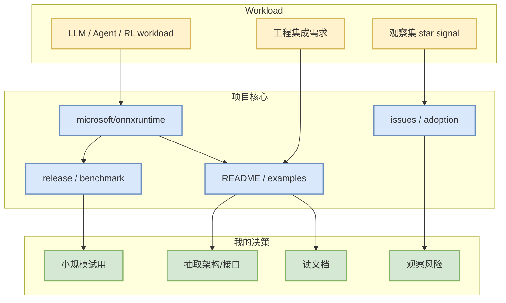

# microsoft/onnxruntime

> 日期：2026-09-25  
> 类型：AI Infra 项目  
> 原文：https://github.com/microsoft/onnxruntime

## 一句话结论
microsoft/onnxruntime 今日作为 `direct watched repo fallback，非完整全网日增；baseline=github-stars-2026-09-24.json` 进入 AI Radar；需要把它当作观察集信号，而不是完整全网排名。

## TL;DR
- Stars / forks：21931 / 4251
- 语言：C++
- 最近更新：2026-09-25T00:08:43Z
- 今日 delta：11
- 摘要：ONNX Runtime: cross-platform, high performance ML inferencing and training accelerator

## 元信息表
| 字段 | 值 |
|---|---|
| repo | `microsoft/onnxruntime` |
| topics | ai-framework, deep-learning, hardware-acceleration, machine-learning, neural-networks, onn |
| source | GitHub direct `/repos` + snapshot fallback |
| source type | GitHub Repository Metadata |
| 原文 | https://github.com/microsoft/onnxruntime |

## 信息压缩图示

## 专业解读
- 对 AI Infra：关注 runtime、scheduler、cache、distributed runtime、kernel 或部署接口是否有可复用设计。
- 对 LLM / Agent：关注是否影响 agent loop、上下文管理、工具调用、评测和代码审查流程。
- 对 RL / Game AI：如果是 Rummy/游戏项目，优先抽取 state/action/reward/evaluator，而不是直接复用低星代码。

## 影响矩阵
| 维度 | 价值 | 风险 |
|---|---|---|
| 工程落地 | 可作为观察集或试用候选 | 今日 GitHub Search 受限，非全网排名 |
| 研究参考 | 可提炼机制 / benchmark / 环境接口 | 需要二次阅读源码和 release |
| 我的行动 | 加入后续深挖列表 | 避免把 stars_delta 解读成全网真实日增 |

## 可信度与局限性
GitHub Search 今日存在 403 rate limit；本页主要来自 direct repo metadata 和历史 snapshot baseline。若 delta 为 `None`，表示缺少可比历史样本。

## 我应该如何跟进
1. 打开 README / releases / examples。
2. 判断是否能在本地小样本复现。
3. 把可复用接口整理到概念卡片或项目 spike。

## 相关链接
- GitHub：https://github.com/microsoft/onnxruntime
- Daily：[[Daily/2026-09-25]]

#ai-radar #github #watchlist
