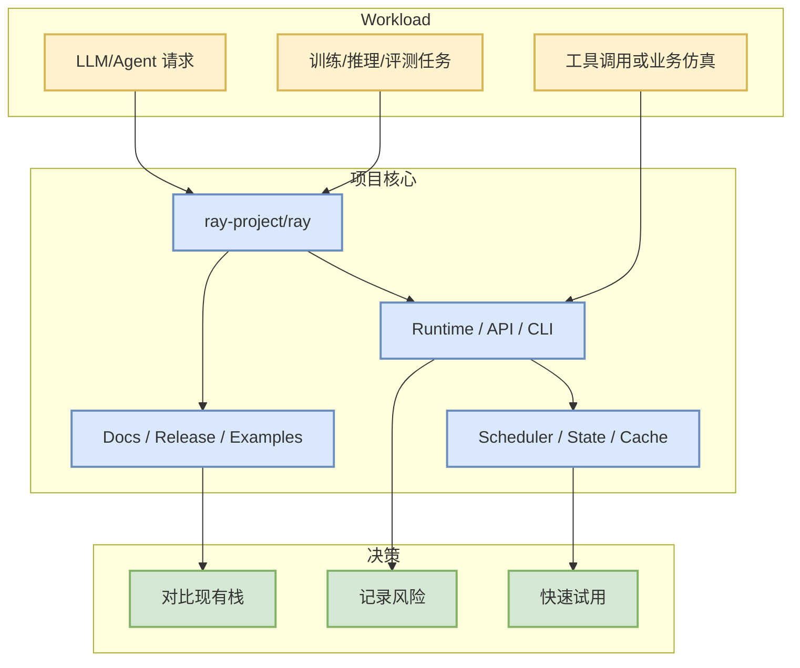

# ray-project/ray

> 一句话结论：Ray is an AI compute engine. Ray consists of a core distributed runtime and a set of AI Libraries for accelerating ML workloads.

## TL;DR
- 来源：direct watched repo fallback。
- Stars/Forks：43927 / 8089；语言：Python。
- 更新时间：2026-09-26T01:02:54Z；原文：https://github.com/ray-project/ray。
- 增长依据：direct watched repo fallback，非完整全网日增；baseline=github-stars-2026-09-25.json。

## 元信息表
| 字段 | 值 |
|---|---|
| repo | ray-project/ray |
| stars | 43927 |
| forks | 8089 |
| language | Python |
| topics | data-science, deep-learning, deployment, distributed, hyperparameter-optimization, hyperparameter-search, large-language-models, llm, llm-inference, llm-serving, machine-learning,  |
| source | direct watched repo fallback |
| 原文 | https://github.com/ray-project/ray |

## 信息压缩图示

## 机制 / 影响矩阵
| 维度 | 观察点 | 对我的影响 |
|---|---|---|
| 工程成熟度 | star、fork、更新频率、release | 判断是否进入试用队列 |
| Infra/Agent 相关性 | serving/training/agent/eval/业务仿真 | 映射到 AI Infra、Loop Engineer 或 Point Rummy 工作流 |
| 风险 | API 变化、文档质量、低置信 fallback | 试用前必须跑最小 demo |

## 专业解读
该项目进入今日榜单的主要原因是它处在固定观察集：AI Infra 项目重点看 scheduler、KV/cache、分布式 runtime、吞吐和延迟；Loop Engineer 项目重点看 agent loop、权限、MCP、上下文工程和代码审查闭环；Point Rummy 项目只作为低置信业务参考，不能直接等价为可上线方案。

## 通俗解释
把它当作一个候选工具或参考实现：先看 README / examples，再决定是否跑小实验。

## 可信度与局限性
- 今日 GitHub Search 从首批查询开始 403；本页使用 direct `/repos` 或历史 snapshot fallback。
- 若标注“非今日实时数据”，表示来自历史 broad snapshot，只能用于连续性观察。

## 我应该如何跟进
1. 打开原 repo 阅读 README、release、examples。
2. 跑最小 demo 或 benchmark。
3. 记录与现有 serving/training/coding-agent/Rummy env 的接口差异。

#ai-radar #github #aiinfra
