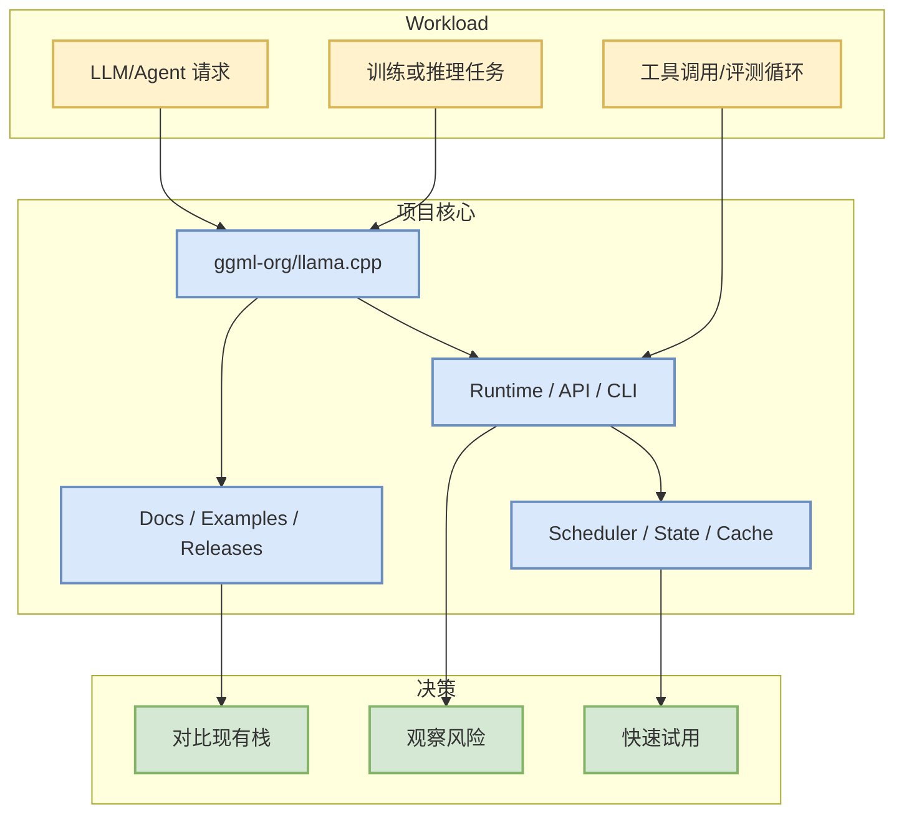

# ggml-org/llama.cpp

> 一句话结论：LLM inference in C/C++

## TL;DR
- 来源：direct /repos fallback
- Stars/Forks：129616 / 23786；语言：C++。
- 更新时间：2026-09-27T00:53:30Z；原文：https://github.com/ggml-org/llama.cpp。
- 增长依据：direct watched repo fallback，非完整全网日增；baseline=github-stars-2026-09-25.json。

## 元信息表
| 字段 | 值 |
|---|---|
| repo | ggml-org/llama.cpp |
| stars | 129616 |
| forks | 23786 |
| language | C++ |
| topics | ggml |
| source | direct /repos fallback |
| 原文 | https://github.com/ggml-org/llama.cpp |

## 信息压缩图示

## 机制 / 影响矩阵
| 维度 | 观察点 | 对我的影响 |
|---|---|---|
| 工程成熟度 | star、fork、更新频率、release | 判断是否进入试用队列 |
| Infra 相关性 | serving/training/agent/eval 组件 | 映射到现有 AI Infra 工作流 |
| 风险 | API 变化、维护频率、文档质量 | 试用前需要先跑 examples/benchmark |

## 专业解读
该项目今日作为 AI Radar 候选进入榜单，主要价值在于为 LLM serving、训练后优化、agent loop 或 coding workflow 提供可观测工程实现。若它属于基础设施类，应重点看调度、吞吐、延迟、KV/cache、分布式与硬件依赖；若属于 coding-agent 类，应重点看权限模式、上下文管理、工具调用、评测闭环和 IDE/CLI 集成。

## 通俗解释
把它当成一个“是否值得拿来做实验”的候选项目：先看活跃度和文档，再决定是否接入自己的小 benchmark。

## 可信度与局限性
- 今日 GitHub Search 已 403，广义榜单使用 direct watched repo 或 previous snapshot fallback。
- 未自动阅读全文 README；结论偏工程雷达，不等于完整评测。

## 我应该如何跟进
1. 打开原 repo 阅读 README/Release。
2. 若与 serving/training/agent loop 强相关，拉取 examples 跑最小 demo。
3. 对比现有栈记录延迟、吞吐、上下文窗口、权限与评测能力。

#ai-radar #github #aiinfra
