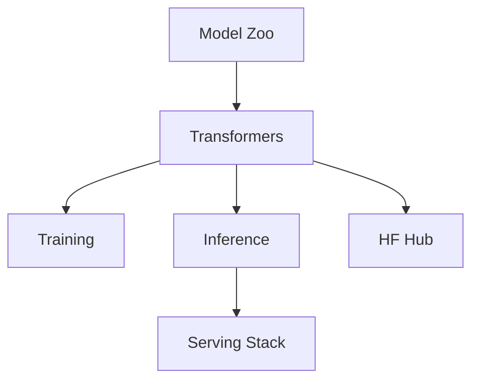

# huggingface/transformers

> 来源类型：GitHub / AI Infra fallback
> 原文：https://github.com/huggingface/transformers

## 一句话结论
Transformers 仍是模型定义、训练和推理集成的核心生态项目。

## TL;DR
- 关注点：模型接入、训练脚本、推理 pipeline、生态兼容。
- 今日数据来自 fallback，非完整全网实时增长。

## 对我的影响
作为 LLM 工程师，仍应用它跟踪新模型接口、tokenizer、推理兼容性和训练示例。

#ai-radar #github #ai-infra
