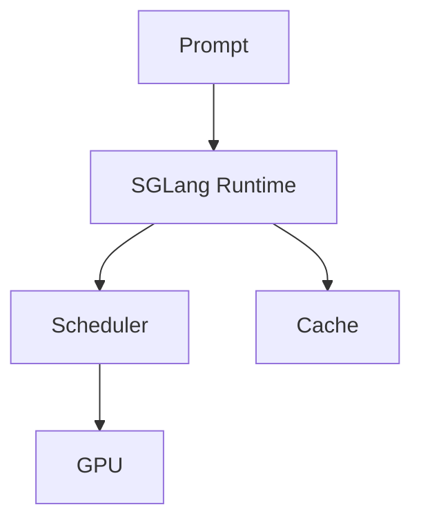

# sgl-project/sglang

> 来源类型：GitHub / AI Infra fallback
> 原文：https://github.com/sgl-project/sglang

## 一句话结论
SGLang 是高性能 LLM/VLM serving 和 agentic inference 的重要项目。

## 对我的影响
适合对比 vLLM，在多模态、structured generation、agent serving 场景做 PoC。

#ai-radar #serving #github
