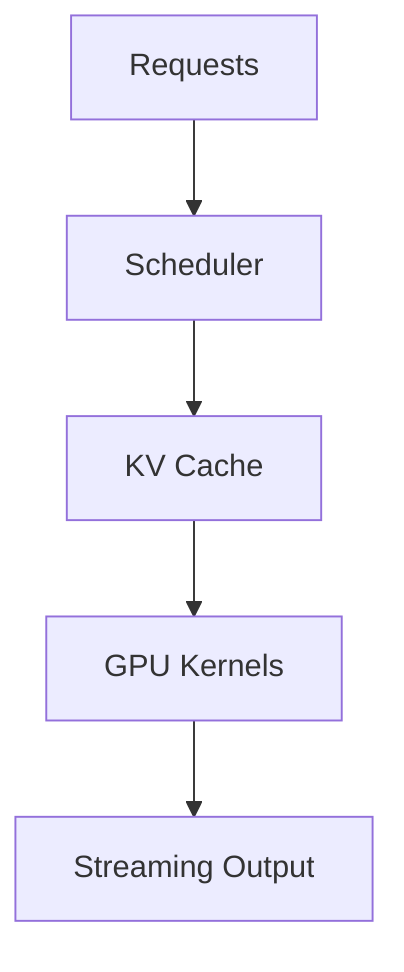

# vllm-project/vllm

> 来源类型：GitHub / AI Infra fallback
> 原文：https://github.com/vllm-project/vllm

## 一句话结论
vLLM 是 LLM serving、KV cache、batching 与吞吐优化的核心观察项目。

## 对我的影响
适合持续跟踪 serving scheduler、PagedAttention、speculative decoding 和生产部署接口变化。

#ai-radar #serving #github
