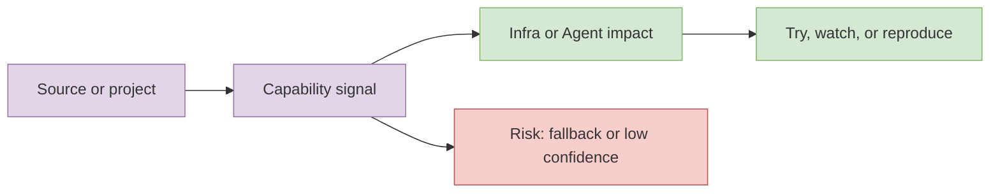

# abubakarmunir712/dsa-final-project

> Date: 2026-10-11
> Source type: GitHub Repo
> Original: https://github.com/abubakarmunir712/dsa-final-project

## One-line conclusion
A Python-based multiplayer Indian Rummy game with support for AI opponents and LAN play. Implements data structures like linked lists, stacks, queues, hashmaps, and graphs to ensure efficient gameplay and intelligent AI decisions.

## TL;DR
- This page is a current-day AI Radar detail note.
- Focus: AI Infra, LLM serving/training, Agent loops, and AI coding workflow.
- Confidence: medium/low where marked; GitHub Search was rate-limited and GitHub metadata uses direct repo fallback.

## Information map

## Professional read
A Python-based multiplayer Indian Rummy game with support for AI opponents and LAN play. Implements data structures like linked lists, stacks, queues, hashmaps, and graphs to ensure efficient gameplay and intelligent AI decisions. It is useful as a watch item for serving, post-training, agent harness, or coding-agent workflows. Do not interpret fallback growth as complete all-GitHub daily growth.

## Impact for me
- AI Infra: watch throughput, scheduling, cache, deployment complexity.
- LLM/Agent: watch context, tool use, and eval loops.
- RL/Game AI: map environment/eval ideas to self-play and simulation where relevant.

## Credibility and limitations
GitHub Search was rate-limited today. Some pages are continuity/fallback notes to keep the Obsidian dashboard navigable.

## Links
- Original: https://github.com/abubakarmunir712/dsa-final-project

#ai-radar #detail
