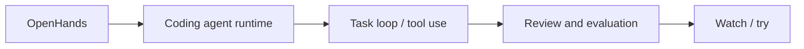

# All-Hands-AI/OpenHands

> Date: 2026-10-11
> Source type: GitHub Repo fallback alias
> Original: https://github.com/All-Hands-AI/OpenHands

## One-line conclusion
OpenHands is kept as a Loop Engineer / coding-agent workflow watch item.

## Information map

## Notes
This alias page exists to resolve the Daily wikilink during a GitHub Search 403 fallback run.

#ai-radar #github #loop-engineering
