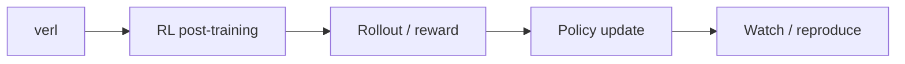

# volcengine/verl

> Date: 2026-10-11
> Source type: GitHub Repo fallback alias
> Original: https://github.com/volcengine/verl

## One-line conclusion
verl remains a post-training / RLHF infrastructure watch item.

## Information map

## Notes
This alias page exists to resolve the Daily wikilink during a GitHub Search 403 fallback run.

#ai-radar #github #rlhf
