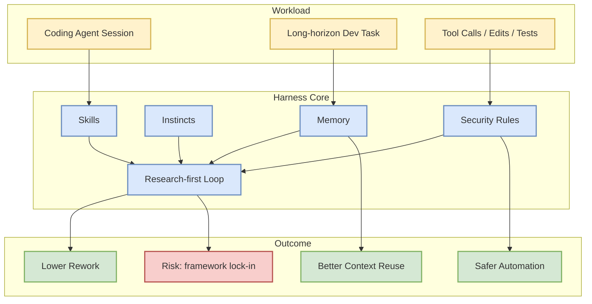
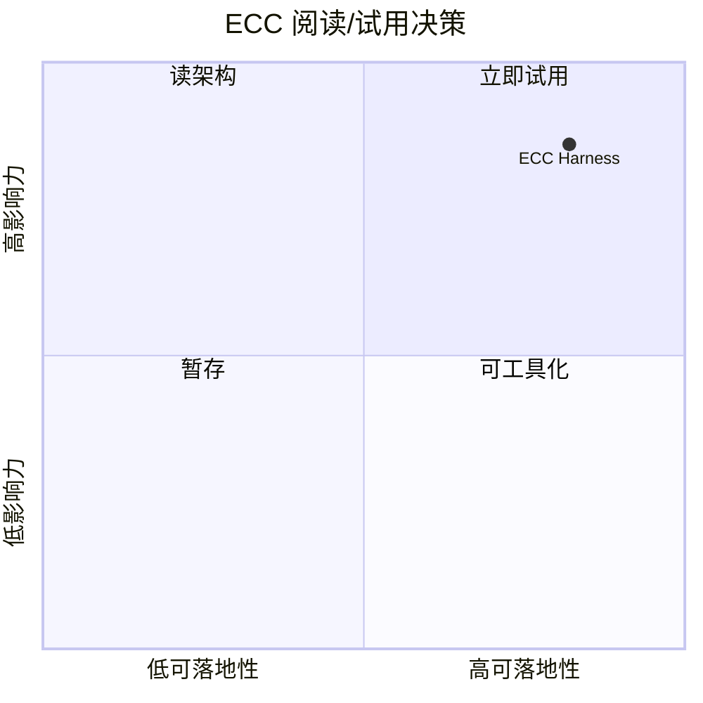

# ECC: Agent Harness Performance Optimization System

> 类型：GitHub
> 大类：GitHub
> 小类：Agent Infra
> 推荐等级：必读
> 创建日期：2026-06-14
> 原文链接：https://github.com/affaan-m/ECC
> 网页详情：https://github.com/dyt27666-oss/AI-news-report-obsidians/blob/main/GitHub/Agents/ECC-agent-harness-performance-optimization.md
> 返回日报：[[Daily/2026-06-14]]

## 一句话结论

ECC 把 skills、instincts、memory、安全和 research-first 开发流程封装为 coding agent harness，代表 agent 工程从 prompt 技巧转向运行时优化。

## TL;DR

- **它是什么**：面向 Claude Code、Codex、OpenCode、Cursor 等 coding agent 的 harness 性能优化系统。
- **为什么重要**：高 star 和高增长说明开发者正在寻找“长期可控 agent runtime”，而不是只靠单次模型调用。
- **和我相关的点**：可对照 Hermes/Codex 工作流，抽取 memory、skills、security、research-first 的约束模式。
- **建议动作**：先读 README 的 architecture、quickstart、security，再决定是否做 30 分钟 spike。

## 元信息

| 字段 | 内容 |
|---|---|
| 发布方/来源 | affaan-m/ECC |
| 来源类型 | GitHub / OSS |
| repo | affaan-m/ECC |
| stars / forks | 214911 / 33032 |
| language | JavaScript |
| updated_at | 2026-06-14 |
| topics | ai-agents, anthropic, claude, claude-code, developer-tools, llm, mcp |
| 原文 | [GitHub](https://github.com/affaan-m/ECC) |
| 是否有 benchmark/docs/examples/release | 需进一步审计；当前只确认 repo 元数据与描述 |
| 是否值得试用 | 值得试用 |

## 信息压缩图示

## 专业解读

ECC 的价值在于把 agent 开发中的隐性经验显式化：什么时候检索上下文、什么时候调用工具、如何保存可复用技能、如何给 agent 加安全边界。这与 AI Infra 的 control plane 思路相似：模型只是执行器，真正决定长期任务质量的是 runtime、状态管理、观测和回归。

## 通俗解释

它像给 coding agent 配了一套“工作习惯和项目记忆”：不只是让模型更聪明，而是让它更会按流程工作、更少忘事、更少乱改。

## 关键机制拆解

| 机制 | 解决的问题 | 为什么有效 | 可能的坑 |
|---|---|---|---|
| Skills | 重复任务反复解释 | 把成功流程固化为可调用步骤 | 技能过时会误导 agent |
| Memory | 长任务上下文丢失 | 保存项目偏好和决策 | 记忆污染需要清理 |
| Security rules | 自动化误操作 | 在工具调用前加边界 | 过严会降低效率 |
| Research-first | 先改后查导致返工 | 强制先搜证据再执行 | 对简单任务可能显得重 |

## 对我的影响

| 维度 | 影响 | 建议动作 |
|---|---|---|
| AI Infra | 可抽象为 agent control plane | 对照 Hermes 的 skills/memory 设计 |
| LLM 工程 | 影响上下文压缩与工具编排 | 看是否有可复用 prompt/rules |
| RL / Game AI | 可借鉴长期 episode 状态管理 | 观察 memory patch 思路 |
| Agent / Eval | 需要配套回归测试 | 记录可量化指标 |

## 可信度与局限性

- 证据强度：GitHub metadata 强，生产成熟度需代码审计。
- 局限性：star 增长不等于工程质量。
- 潜在风险：如果缺少 benchmark，可能只是流程集合而非可验证系统。
- 还需要确认：release、docs、examples、license、实际用户反馈。

## 我应该如何跟进

1. 读 README 的 architecture 和 quickstart。
2. 找是否有 benchmark、examples、security policy。
3. 抽取可迁移到 Hermes/Codex 的 rules/memory 模式。

## 相关链接

- 原文：https://github.com/affaan-m/ECC
- 网页详情：https://github.com/dyt27666-oss/AI-news-report-obsidians/blob/main/GitHub/Agents/ECC-agent-harness-performance-optimization.md
- 相关卡片：[[Daily/2026-06-14]]

## 标签

#ai-radar #github #agent #ai-infra #llm
