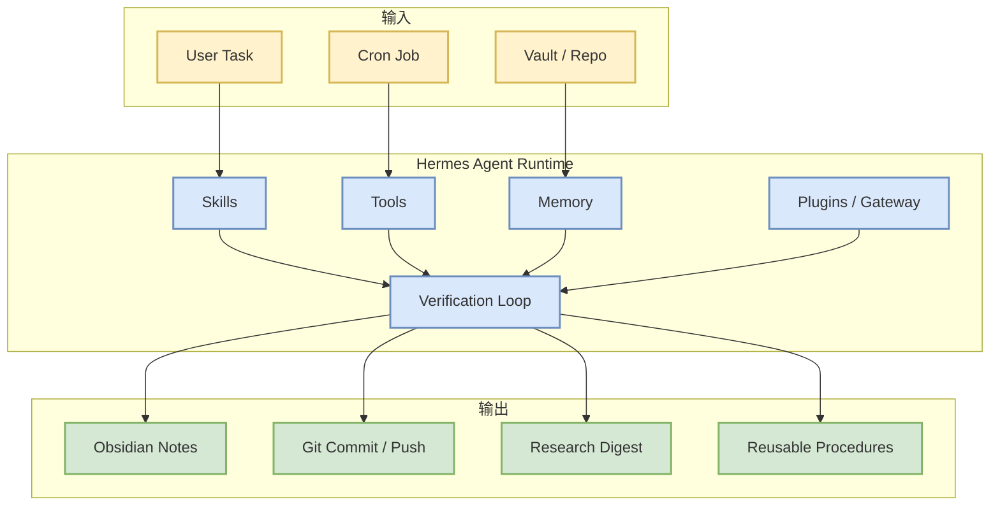
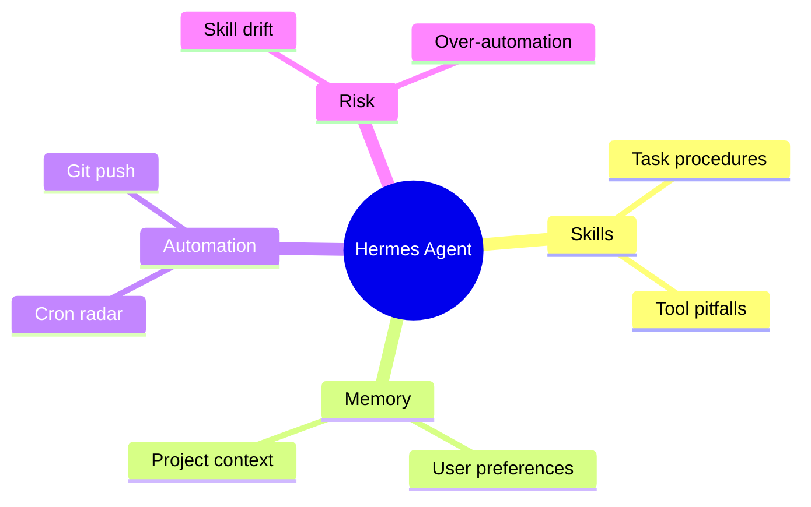

# Hermes Agent: grows with you

> 类型：GitHub
> 大类：GitHub
> 小类：Agent Infra
> 推荐等级：必读
> 创建日期：2026-06-14
> 原文链接：https://github.com/NousResearch/hermes-agent
> 网页详情：https://github.com/dyt27666-oss/AI-news-report-obsidians/blob/main/GitHub/Agents/hermes-agent.md
> 返回日报：[[Daily/2026-06-14]]

## 一句话结论

Hermes Agent 以 +780 stars 的真实日增位居今日增长榜第一，说明可持续成长的 skills / memory / tools agent 体系正在快速吸引关注。

## TL;DR

- **它是什么**：带技能、记忆、工具和自动化能力的 agent 平台。
- **为什么重要**：从“一次性聊天”转向“长期可积累能力”的 agent 架构。
- **和我相关的点**：当前 AI Radar 就运行在 Hermes 上，项目变化会直接影响日报、技能、cron 和 Obsidian 工作流。
- **建议动作**：持续跟踪 release 与 skill/memory 机制变化。

## 元信息

| 字段 | 内容 |
|---|---|
| 发布方/来源 | NousResearch/hermes-agent |
| 来源类型 | GitHub / OSS |
| repo | NousResearch/hermes-agent |
| stars / forks | 192770 / 22970 |
| language | Python |
| stars_delta | 780 |
| 原文 | [GitHub](https://github.com/NousResearch/hermes-agent) |
| 是否值得试用 | 已在使用，继续跟踪 |

## 信息压缩图示

## 专业解读

Hermes 的核心趋势是把 agent 能力沉淀到环境中：技能提供过程记忆，工具提供行动面，cron 提供持续性，Obsidian/Git 提供外部知识库和可审计历史。对 AI Infra 来说，这类似一个轻量 agent platform：有控制面、执行面、状态层和验证层。

## 通俗解释

它不是一个只会回答问题的聊天机器人，而是一个会记住怎么工作、能定时执行任务、能把结果写进知识库的助理。

## 关键机制拆解

| 机制 | 解决的问题 | 为什么有效 | 可能的坑 |
|---|---|---|---|
| Skills | 复杂流程无法复用 | 成功经验可固化 | 过时技能会造成错误 |
| Cron | 需要每天重复执行 | 自动触发完整流程 | 失败时必须有验收 |
| Obsidian-first | 信息难以长期沉淀 | 日报索引 + 详情页知识库 | 链接和模板需维护 |

## 对我的影响

| 维度 | 影响 | 建议动作 |
|---|---|---|
| AI Infra | agent platform 设计参考 | 跟踪 runtime 和 gateway 变化 |
| LLM 工程 | 提供 prompt 外的能力沉淀 | 优化技能与验证步骤 |
| RL / Game AI | 长期任务执行可借鉴 episode memory | 关注 memory patch 机制 |
| Agent / Eval | 可建立自动化回归 | 将日报验收做成脚本 |

## 可信度与局限性

- 证据强度：来自 GitHub snapshot 和当前实际使用。
- 局限���：开源热度不代表所有功能稳定。
- 风险：自动化越强，越需要验收和回滚策略。

## 我应该如何跟进

1. 跟踪 release notes 和 breaking changes。
2. 把 AI Radar 的失败点沉淀为技能或脚本。
3. 给日报固定验收项增加自动测试。

## 相关链接

- 原文：https://github.com/NousResearch/hermes-agent
- 网页详情：https://github.com/dyt27666-oss/AI-news-report-obsidians/blob/main/GitHub/Agents/hermes-agent.md
- 相关卡片：[[Daily/2026-06-14]]

## 标签

#ai-radar #github #hermes #agent #automation
