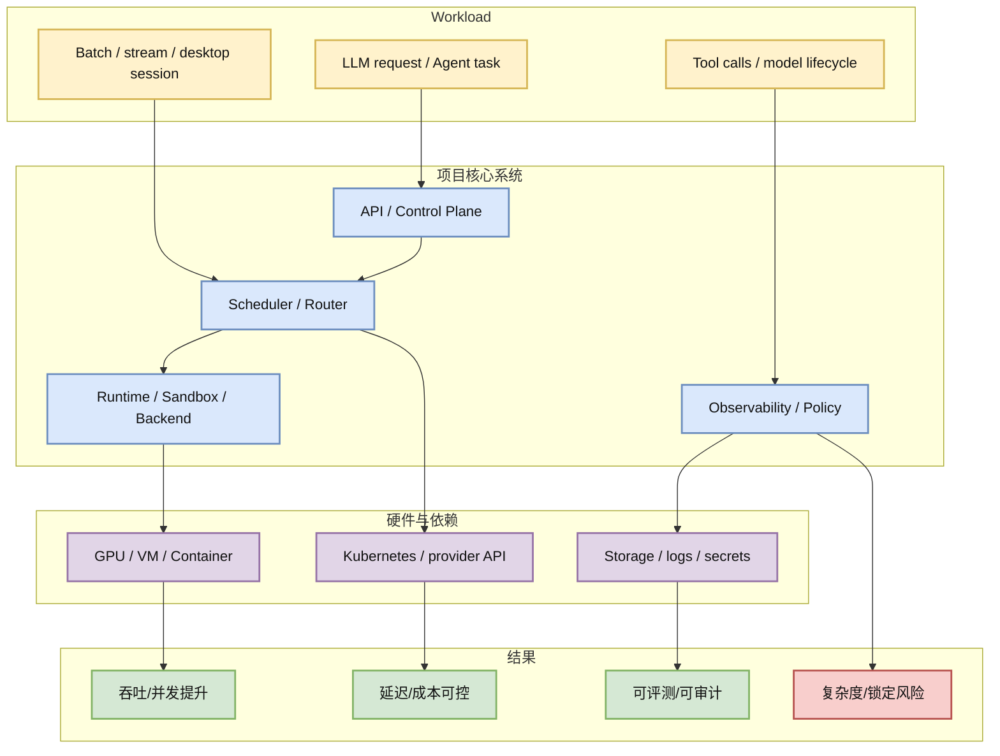

# trycua/cua - Computer-Use Agent Infrastructure

> 类型：GitHub
> 大类：GitHub
> 小类：Agent / Computer Use / Eval
> 推荐等级：必读
> 创建日期：2026-06-09
> 原文链接：https://github.com/trycua/cua
> 网页详情：https://github.com/dyt27666-oss/AI-news-report-obsidians/blob/main/GitHub/Agents/trycua%20Computer-Use%20Agent%20Infrastructure.md
> 返回日报：[[Daily/2026-06-09]]

## 一句话结论

cua 提供 Computer-Use Agents 的 sandbox、SDK 和 benchmark，覆盖 macOS/Linux/Windows 桌面控制，是 GUI/desktop Agent 训练评测基础设施信号。

## TL;DR

- **它是什么**：trycua/cua，一个 Agent / Computer Use / Eval 方向的开源项目。
- **为什么重要**：它把模型推理/Agent 执行/请求治理中的一层工程能力独立成可部署组件。
- **和我相关的点**：可用于比较内部 serving、Agent sandbox、eval harness 或 gateway/control-plane 设计。
- **建议动作**：先读 docs/examples，再用最小 workload 试部署，不要只看 stars。

## 元信息

| 字段 | 内容 |
|---|---|
| repo | trycua/cua |
| stars / forks | 17761 / 1138 |
| 语言 | HTML |
| 最近更新时间 | 2026-06-09 |
| topics | agent, computer-use, desktop-automation, virtualization, macos, windows-sandbox |
| 原文 | [GitHub](https://github.com/trycua/cua) |
| 是否有 docs/examples/release | GitHub 元数据可确认 issues/wiki；docs/examples/release 需进入仓库继续检查 |
| 是否值得试用 | 必读 |

## 信息压缩图示

### 试用决策矩阵

| 维度 | 观察点 | 结论 |
|---|---|---|
| 成熟度 | stars 17761、forks 1138、近期更新 2026-06-09 | 社区活跃度有信号 |
| 集成价值 | 是否能接入 vLLM/SGLang/Agent sandbox/observability | 与内部平台有关 |
| 风险 | API 稳定性、权限、安全、资源成本 | 先 sandbox 试用 |

## 专业解读

trycua/cua 的价值不在于替代所有平台能力，而在于暴露一个清晰趋势：AI Infra 正在拆成多层控制面。Serving 不只是模型 runtime，还包括调度、cache、gateway、生命周期、sandbox、审计与评测。对用户来说，这类项目适合用来做架构对照：哪些能力应该自己做，哪些可以接入开源组件，哪些只适合借鉴接口。

## 通俗解释

它相当于给大模型或 Agent 应用加了一层“操作系统/调度台”，让请求、环境、模型后端和日志不要散落在各处。

## 关键机制拆解

| 机制 | 解决的问题 | 为什么有效 | 可能的坑 |
|---|---|---|---|
| Control plane | 多后端/多任务难统一管理 | 集中路由、生命周期和策略 | 引入新单点和学习成本 |
| Runtime abstraction | 后端和环境差异大 | 用统一接口屏蔽差异 | 抽象可能牺牲性能或灵活性 |
| Observability | 线上问题难复盘 | 日志、指标、trace 可审计 | 采集成本和隐私风险 |

## 对我的影响

| 维度 | 影响 | 建议动作 |
|---|---|---|
| AI Infra | 可作为平台控制面/网关/调度层参考 | 读部署文档，画内部对照图 |
| LLM 工程 | 影响请求治理、provider 切换、serving 后端选择 | 做最小压测 |
| RL / Game AI | Agent sandbox/环境可用于 rollout/eval | 检查并行和 reset 能力 |
| Agent / Eval | 可能提供可审计执行环境 | 接入 eval harness 原型 |

## 可信度与局限性

- 证据强度：GitHub API 元数据可确认 stars、forks、语言、更新时间。
- 局限性：未完整审计代码质量、release cadence 和安全模型。
- 潜在风险：高 star 不等于生产可用；需要真实 workload 验证。

## 我应该如何跟进

1. 阅读 README、architecture、examples 和 release note。
2. 用一个小模型/小 Agent task 跑最小闭环。
3. 记录与内部平台能力的重叠和缺口。

## 相关链接

- 原文：https://github.com/trycua/cua
- 网页详情：https://github.com/dyt27666-oss/AI-news-report-obsidians/blob/main/GitHub/Agents/trycua%20Computer-Use%20Agent%20Infrastructure.md
- 相关卡片：[[Daily/2026-06-09]]

## 标签

#ai-radar #github #ai-infra #agent
