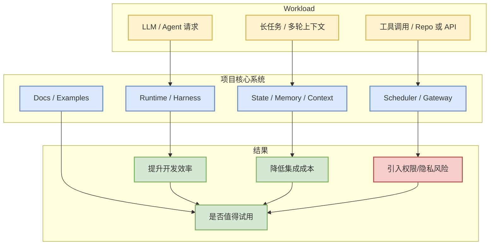

# BerriAI/litellm

> 类型：GitHub 项目
> 大类：GitHub
> 小类：Agent / AI Infra
> 推荐等级：可 skim
> 创建日期：2026-06-13
> 原文链接：https://github.com/BerriAI/litellm
> 网页详情：https://github.com/dyt27666-oss/AI-news-report-obsidians/blob/main/GitHub/BerriAI__litellm_2026_06_13.md
> 返回日报：[[Daily/2026-06-13]]

## 一句话结论

BerriAI/litellm 今日进入 AI Radar GitHub 观察池：Python SDK, Proxy Server (AI Gateway) to call 100+ LLM APIs in OpenAI (or native) format, with cost tracking, guardrails, loadbalancing and logging. [Bedrock, Azure, OpenAI, VertexAI, Cohere, Anthropic, Sagemaker, HuggingFace, VLLM, NVIDIA NIM]。

## TL;DR

- **它是什么**：GitHub 项目，语言 Python，stars 50193，forks 8834。
- **为什么重要**：主题包含 ai-gateway, anthropic, azure-openai, bedrock, gateway, langchain, litellm, llm, llm-gateway, llmops, mcp-gateway, openai, openai-proxy, vertex-ai，与 agent、LLM infra 或 AI gateway 强相关。
- **和我相关的点**：可作为 agent runtime、memory、coding workflow、gateway 或开发工具链的参考实现。
- **建议动作**：先阅读 README / examples / release，再决定是否本地试用。

## 元信息

| 字段 | 内容 |
|---|---|
| repo | BerriAI/litellm |
| stars / forks | 50193 / 8834 |
| language | Python |
| updated_at | 2026-06-13T01:01:06Z |
| pushed_at | 2026-06-13T01:01:02Z |
| topics | ai-gateway, anthropic, azure-openai, bedrock, gateway, langchain, litellm, llm, llm-gateway, llmops, mcp-gateway, openai, openai-proxy, vertex-ai |
| stars_delta | 无历史基线 |
| 原文 | [GitHub](https://github.com/BerriAI/litellm) |
| 是否值得试用 | 快速试用 |

## 信息压缩图示

### 辅助结构：试用判断矩阵

| 检查项 | 当前判断 | 为什么 |
|---|---|---|
| docs/examples | 待确认 | 需要读 README 与示例 |
| benchmark | 待确认 | GitHub metadata 不足以判断 |
| release 活跃度 | 中高 | pushed_at/updated_at 较新 |
| 集成风险 | 中 | agent 工具通常涉及权限、token、数据边界 |

## 专业解读

这个项目值得放入观察池，但不能只按 star 判断价值。对 AI Infra 工程，关键是看它有没有清晰的 runtime 边界、状态管理方式、错误恢复、权限隔离和可观测性；对 LLM 工程，关键是看它如何处理上下文压缩、模型路由、工具调用和评测反馈。若这些能力只有 demo 而无测试或 release，则只适合作为设计参考。

## 通俗解释

它像是一个把 AI agent 落到真实开发/系统工作流里的工具。star 多说明大家关注，但真正能不能用，要看它是否能安全接入你的代码、数据和基础设施。

## 关键机制拆解

| 机制 | 解决的问题 | 为什么有效 | 可能的坑 |
|---|---|---|---|
| Agent harness | 把多步任务串起来 | 降低 glue code 成本 | 权限过大容易出事故 |
| Context/state | 保留跨步骤信息 | 减少重复上下文构造 | 可能泄露敏感数据 |
| Gateway/Tooling | 接入外部系统 | 提升自动化程度 | 调试和审计复杂 |

## 对我的影响

| 维度 | 影响 | 建议动作 |
|---|---|---|
| AI Infra | 可参考 runtime/control plane | 看架构与部署方式 |
| LLM 工程 | 可参考上下文与工具调用 | 检查 prompt/eval 策略 |
| RL / Game AI | 若支持多步环境，可借鉴 harness | 暂作观察 |
| Agent / Eval | 可加入 agent 工具链对比 | 本周 skim README |

## 可信度与局限性

- 证据强度：GitHub metadata + star delta，能说明关注度，不能说明质量。
- 局限性：未完整审计代码、benchmark、license 和安全边界。
- 还需要确认：docs、examples、release、CI、benchmark、隐私策略。

## 我应该如何跟进

1. 阅读 README、examples、release notes。
2. 记录 runtime、状态、权限、日志和测试设计。
3. 小规模 sandbox 试用，避免接入真实凭证和私有代码。

## 相关链接

- 原文：https://github.com/BerriAI/litellm
- 网页详情：https://github.com/dyt27666-oss/AI-news-report-obsidians/blob/main/GitHub/BerriAI__litellm_2026_06_13.md
- 相关卡片：[[Daily/2026-06-13]]

## 标签

#ai-radar #github #agent #ai-infra
