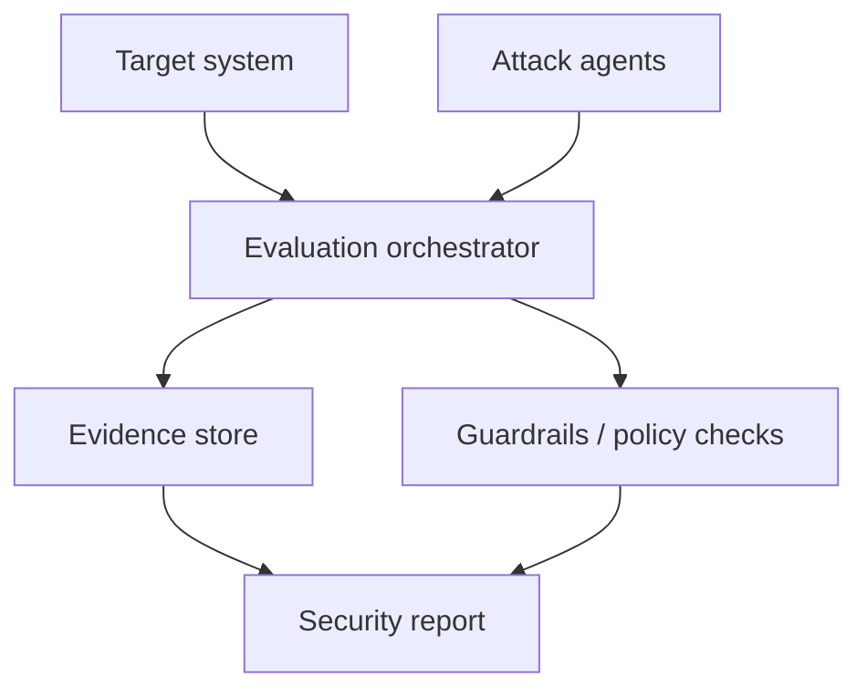

# Cisco Foundry Security Spec

> 类型：GitHub 项目
> 分类：Agent Security / Evaluation
> 推荐等级：可收藏
> 创建日期：2026-06-08
> 原文链接：https://github.com/CiscoDevNet/foundry-security-spec

## 一句话结论

Cisco Foundry 是一个 agentic AI security evaluation 规范，不是代码库；虽然 stars 只有 129，但对设计企业级 Agent 安全评测架构有参考价值。

## 元信息

- 来源：GitHub
- 作者/机构：CiscoDevNet / Cisco Advanced Security Initiatives Group
- 发布时间：2026-05-04 创建；2026-05-12 最近 push
- Stars：129；Forks：19
- 代码/规范链接：https://github.com/CiscoDevNet/foundry-security-spec
- 相关标签：agentic-ai-security, security-evaluation

## 专业解读

Foundry 把内部 agentic security evaluation 经验沉淀为组织中立规范，强调角色、架构不变量和护栏，而不是提供一套绑定 Cisco stack 的实现。对 AI Infra 来说，这类 spec 的价值在于帮助拆分 target、attacker/evaluator agent、orchestrator、evidence store、policy gate 等组件，避免把红队评测写成一次性脚本。

## 通俗解释

它像一份如何搭建 AI Agent 安全测试系统的蓝图，告诉你需要哪些角色和安全护栏。

## 图示

## 核心要点

- 成熟度：seed v0.1.0，规范早期但来自实际内部经验。
- 工程价值：适合作为 Agent 安全评测平台的架构 checklist。
- 集成价值：可与 promptfoo、sandbox、审计日志结合。

## 对我的影响

- AI Infra：设计 Agent 平台时需要内置安全评测组件和证据链。
- LLM 工程：安全 eval 不应只依赖模型自评，需要独立角色和可审计流程。
- RL / Game AI：对抗性任务也可以借鉴多角色 evaluator/attacker 设计。
- 是否值得试用：可收藏；用于评审内部 Agent eval 架构。

## 局限性 / 风险

- 不是可直接运行的工具，需要团队实现。
- 规范早期，覆盖面和行业共识仍需观察。

## 相关链接

- 原文：https://github.com/CiscoDevNet/foundry-security-spec
- 相关卡片：[[Concepts/Agent Evaluation Contamination]]

#ai-radar #github #agent-security #eval
