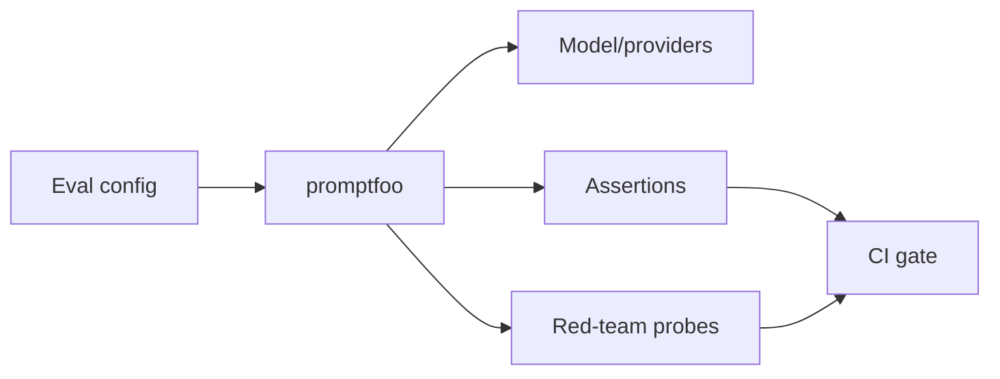

# promptfoo LLM Eval and Red Teaming

> 类型：GitHub 项目
> 分类：Evaluation / AgentOps
> 推荐等级：必读
> 创建日期：2026-06-08
> 原文链接：https://github.com/promptfoo/promptfoo

## 一句话结论

promptfoo 已从 prompt 测试工具扩展为 LLM/Agent/RAG eval 与 red-teaming 平台，21k+ stars，适合纳入 CI/CD 质量门禁。

## 元信息

- 来源：GitHub
- 作者/机构：promptfoo
- 发布时间：2023-04-28 创建；2026-06-08 活跃 push
- Stars：21,994；Forks：1,951；Open issues：323
- 代码链接：https://github.com/promptfoo/promptfoo
- 文档：https://promptfoo.dev
- 相关标签：llm-evaluation, red-teaming, ci-cd, rag, agents

## 专业解读

LLM 应用的工程化瓶颈正在从能否调用模型转向能否持续证明质量、安全和成本可控。promptfoo 的价值在于把 eval case、provider matrix、断言、red team attack、CI 集成做成配置化流程。结合今天的 Agent evaluation contamination 论文，promptfoo 这类工具还需要加入随机化、搜索隔离和反作弊审计，才能支撑 Agent RL 的 reward/eval 闭环。

## 通俗解释

它像大模型应用的自动化测试工具：每次改 prompt、换模型、改 RAG，都能自动跑测试，发现质量下降或安全问题。

## 图示

## 核心要点

- 成熟度：MIT，21k+ stars，被主流团队使用信号强。
- 工程价值：把 eval 纳入 CI/CD，而不是临时 notebook。
- 集成价值：适合与 tracing、Agent sandbox、RL reward validation 联动。

## 对我的影响

- AI Infra：可作为模型网关/Agent 平台的质量门禁组件。
- LLM 工程：把 prompt/RAG regression test 标准化。
- RL / Game AI：训练 reward 更新前后可用 promptfoo 跑行为回归。
- 是否值得试用：必读；梳理内部 eval case 能否迁入 declarative config。

## 局限性 / 风险

- 配置化 eval 容易覆盖不到真实长尾，需要持续补充线上样本。
- Agent 任务需要额外处理状态、工具调用和搜索污染。

## 相关链接

- 原文：https://github.com/promptfoo/promptfoo
- 文档：https://promptfoo.dev
- 相关卡片：[[Concepts/Agent Evaluation Contamination]]

#ai-radar #github #eval #red-teaming #agentops
