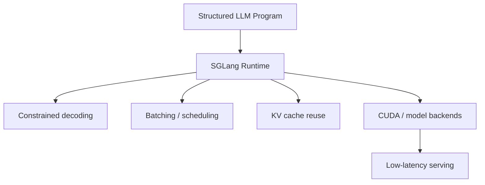

# SGLang High-Performance LLM Serving Framework

> 类型：GitHub 项目
> 分类：AI Infra / Serving
> 推荐等级：必读
> 创建日期：2026-06-08
> 原文链接：https://github.com/sgl-project/sglang

## 一句话结论

SGLang 以 28k+ stars 和高频更新继续成为 vLLM 之外最值得跟踪的 LLM/VLM serving 框架，尤其适合关注复杂推理程序、VLM、MoE 和多后端性能。

## 元信息

- 来源：GitHub
- 作者/机构：sgl-project
- 发布时间：2024-01-08 创建；2026-06-08 仍活跃 push
- Stars：28,884；Forks：6,389；Open issues：3,765
- 代码链接：https://github.com/sgl-project/sglang
- 文档：https://sglang.io
- 相关标签：inference, llm, vlm, cuda, moe, reinforcement-learning

## 专业解读

SGLang 的定位是高性能 serving + structured generation/runtime。相比只把模型包装成 API，它更强调把多步 LLM 程序、约束解码、批处理、缓存和后端 kernel 组合起来。对 Agent 和 RL rollout，这类 runtime 的价值在于把多轮调用和工具/采样策略压进更可控的执行框架，减少 Python orchestration 开销。

## 通俗解释

它是另一个很强的大模型服务框架，适合把复杂的多步问答、多模态推理流程跑得更快、更稳定。

## 图示

## 核心要点

- 成熟度：Apache-2.0，社区活跃，已形成 vLLM 的强对照组。
- 适配方向：LLM、VLM、MoE、Qwen/DeepSeek/GLM 等新模型。
- 集成价值：适合做 Agent workflow serving 和复杂 decoding benchmark。

## 对我的影响

- AI Infra：建议纳入 serving 对比矩阵，不只看吞吐，也看复杂请求/多模态/约束解码。
- LLM 工程：Agent eval 或 synthetic data pipeline 可测试 SGLang 的 runtime 表达能力。
- RL / Game AI：多策略采样、批量 rollout 可能受益于更强的 runtime 编排。
- 是否值得试用：必读；与 vLLM 做同模型、同硬件、同 workload 压测。

## 局限性 / 风险

- 生态和文档体验可能随快速迭代波动。
- 复杂 runtime 带来调试成本，生产化要关注观测性和错误隔离。

## 相关链接

- 原文：https://github.com/sgl-project/sglang
- 文档：https://sglang.io
- 相关卡片：[[GitHub/Infra/vLLM High-Throughput LLM Serving Engine]]

#ai-radar #github #serving #sglang #ai-infra
