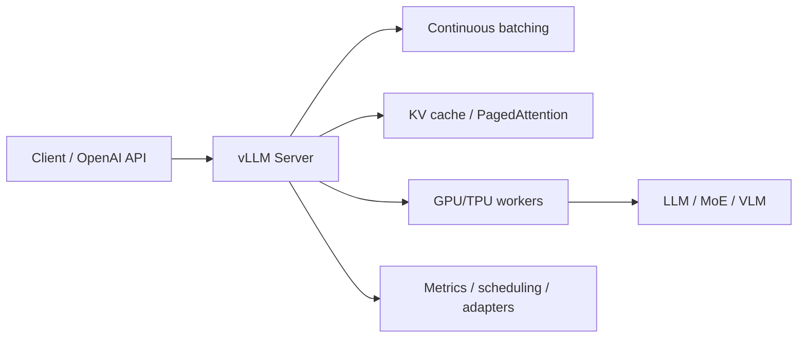

# vLLM High-Throughput LLM Serving Engine

> 类型：GitHub 项目
> 分类：AI Infra / Serving
> 推荐等级：必读
> 创建日期：2026-06-08
> 原文链接：https://github.com/vllm-project/vllm

## 一句话结论

vLLM 仍是开源 LLM serving 的基准项目，82k+ stars、当天仍高频提交，适合作为吞吐、KV cache、OpenAI-compatible serving 的工程参照。

## 元信息

- 来源：GitHub
- 作者/机构：vllm-project / UC Berkeley Sky Computing Lab 社区
- 发布时间：2023-02-09 创建；2026-06-08 仍活跃 push
- Stars：82,199；Forks：17,785；Open issues：5,242
- 代码链接：https://github.com/vllm-project/vllm
- 文档：https://vllm.ai
- 相关标签：inference, llm-serving, cuda, moe, qwen, deepseek, tpu

## 专业解读

vLLM 的价值不只是 PagedAttention，而是已经演化成模型 serving 控制平面和数据平面的事实标准之一：OpenAI API 兼容、批处理、KV cache 管理、多硬件后端、MoE/新模型适配都在同一项目里快速迭代。对 AI Infra 工程师，vLLM 是验证 serving feature 的 baseline；对训练/后训练团队，它常被接入 RL rollout、eval、synthetic data generation。

## 通俗解释

它像一个高性能模型服务器，让大模型更快、更省显存地对外提供 API。很多团队不是自己从零写推理服务，而是在 vLLM 上改造。

## 图示

## 核心要点

- 成熟度高：Apache-2.0、82k+ stars、社区和企业采用广。
- 工程信号强：2026-06-08 仍有 push，说明对新模型和新硬件适配很快。
- 集成价值：可作为 eval server、RL rollout inference backend、在线服务 baseline。

## 对我的影响

- AI Infra：关注它对 MoE、新 GPU、KV cache、speculative decoding 的实现路径。
- LLM 工程：后训练和评测管线可优先以 vLLM 做吞吐基准。
- RL / Game AI：多环境 rollout 场景里，vLLM 的批处理能力会影响样本生成速度。
- 是否值得试用：必读；保留一套内部 benchmark 对比 vLLM/SGLang/TensorRT-LLM。

## 局限性 / 风险

- Open issues 很多，生产接入要锁版本并做回归压测。
- 高性能特性依赖模型结构和硬件后端，不能假设所有模型同样收益。

## 相关链接

- 原文：https://github.com/vllm-project/vllm
- 文档：https://vllm.ai
- 相关卡片：[[GitHub/Infra/SGLang High-Performance LLM Serving Framework]]

#ai-radar #github #serving #vllm #ai-infra
