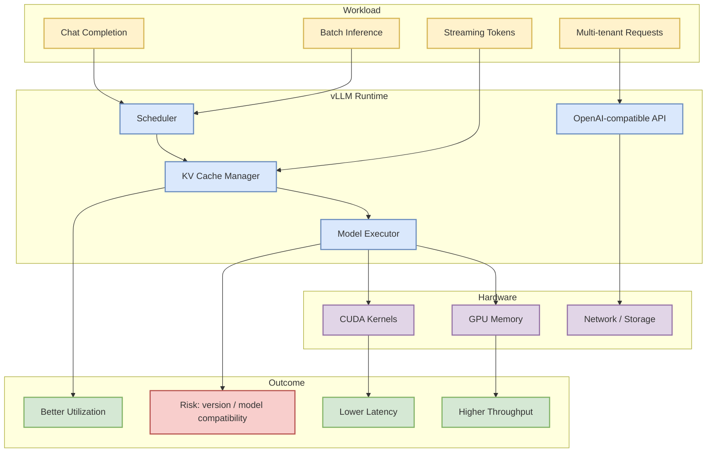
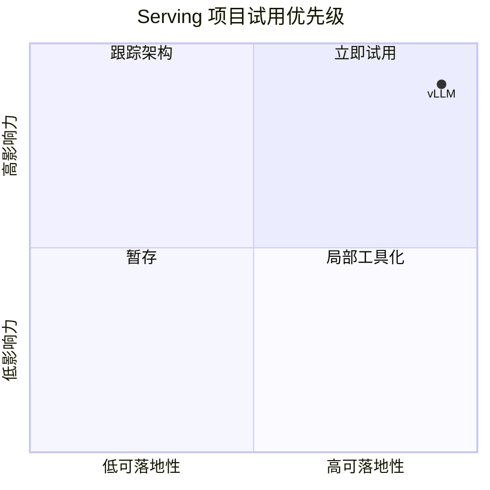

# vLLM: high-throughput LLM serving engine

> 类型：GitHub
> 大类：GitHub
> 小类：LLM Serving
> 推荐等级：必读
> 创建日期：2026-06-14
> 原文链接：https://github.com/vllm-project/vllm
> 网页详情：https://github.com/dyt27666-oss/AI-news-report-obsidians/blob/main/GitHub/Infra/vllm-serving-engine.md
> 返回日报：[[Daily/2026-06-14]]

## 一句话结论

vLLM 仍在今日真实增长榜中，说明高吞吐、低成本、内存高效的 LLM serving 仍是 AI Infra 的核心刚需。

## TL;DR

- **它是什么**：高吞吐、内存高效的 LLM inference / serving engine。
- **为什么重要**：推理成本、KV cache、batching、scheduler 是模型产品化的成本曲线关键。
- **和我相关的点**：直接对应 LLM serving / inference / KV cache / batching / scheduler 关注域。
- **建议动作**：持续跟踪 release、benchmark、调度策略和与 LiteLLM/NIM/Ray 的集成。

## 元信息

| 字段 | 内容 |
|---|---|
| 发布方/来源 | vllm-project/vllm |
| 来源类型 | GitHub / OSS |
| repo | vllm-project/vllm |
| stars / forks | 82777 / 14129 |
| language | Python |
| stars_delta | 55 |
| 原文 | [GitHub](https://github.com/vllm-project/vllm) |
| 是否值得试用 | 值得试用 |

## 信息压缩图示

## 专业解读

vLLM 的持续增长说明推理基础设施已经从“能跑模型”进入“稳定、低成本、高吞吐地服务模型”的阶段。对工程团队来说，重点不是单一吞吐数字，而是调度策略、KV cache 管理、多租户隔离、OpenAI-compatible API、模型兼容性和 observability。

## 通俗解释

vLLM 像是大模型服务的高性能发动机：同样的 GPU，能承载更多请求、更低延迟、更少浪费。

## 关键机制拆解

| 机制 | 解决的问题 | 为什么有效 | 可能的坑 |
|---|---|---|---|
| Scheduler | 请求并发与吞吐冲突 | 动态组织 batch | 复杂场景下尾延迟需监控 |
| KV Cache | 长上下文内存压力 | 复用注意力缓存 | 内存碎片和 eviction 策略重要 |
| API Server | 接入成本 | 兼容 OpenAI 风格接口 | 与 gateway/鉴权/限流需集成 |

## 对我的影响

| 维度 | 影响 | 建议动作 |
|---|---|---|
| AI Infra | serving baseline 项目 | 跟踪 benchmark 和 release |
| LLM 工程 | 影响部署成本��� latency | 与 LiteLLM gateway 组合测试 |
| RL / Game AI | 可支撑 rollout / evaluator 服务 | 评估并发推理吞吐 |
| Agent / Eval | 多 agent 会放大 serving 压力 | 关注 streaming 与并发 |

## 可信度与局限性

- 证据强度：成熟 OSS + 高 star + 真实增长。
- 局限性：不同模型、GPU、量化方案下表现差异大。
- 风险：升级可能引入模型兼容和 kernel 依赖问题。

## 我应该如何跟进

1. 查看最新 release notes。
2. 对照当前服务栈记录 vLLM、SGLang、TensorRT-LLM 的适用边界。
3. 做一个小规模 benchmark 模板。

## 相关链接

- 原文：https://github.com/vllm-project/vllm
- 网页详情：https://github.com/dyt27666-oss/AI-news-report-obsidians/blob/main/GitHub/Infra/vllm-serving-engine.md
- 相关卡片：[[Daily/2026-06-14]]

## 标签

#ai-radar #github #serving #llm #ai-infra
