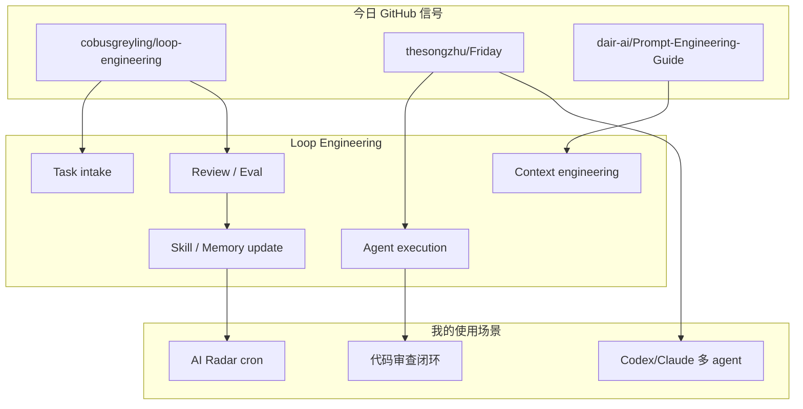
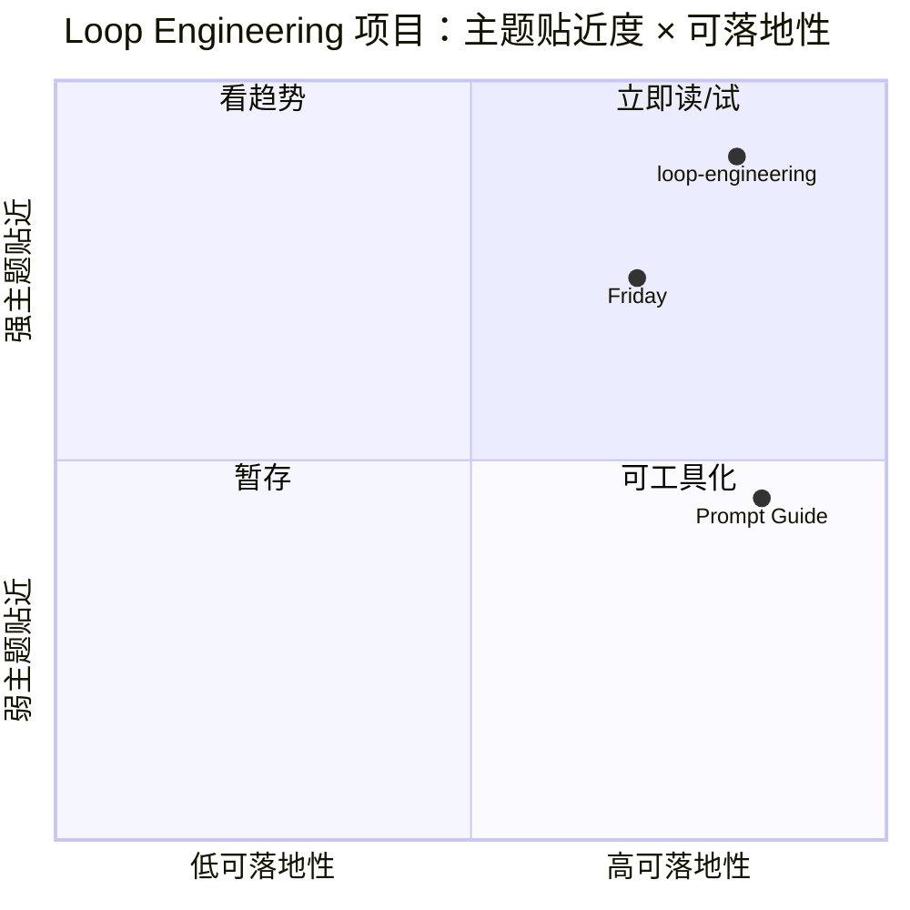

# Loop Engineer / Loop Engineering GitHub Watchlist - 2026-06-30

> 返回日报：[[Daily/2026-06-30]]  
> 来源：GitHub Search + AI Radar snapshot

## 一句话结论
Loop Engineering 主题已纳入 AI Radar 固定扫描；今日可见项目不多，但 `cobusgreyling/loop-engineering` 与 `thesongzhu/Friday` 对 coding-agent loop、harness、control plane 有直接参考价值。

## TL;DR
- **高 star**：`dair-ai/Prompt-Engineering-Guide` star 高，但更泛化；`cobusgreyling/loop-engineering` 更贴近 loop engineer 主题。
- **增长**：`dair-ai/Prompt-Engineering-Guide` +135，`thesongzhu/Friday` +1，`cobusgreyling/loop-engineering` 因无历史 baseline 暂按冷启动代理。
- **业务价值**：把 AI coding 从一次性 prompt 变成可复用 loop：plan、execute、review、eval、memory、skills、rollback。

## 信息压缩图示

## Loop Engineer GitHub 高 star Top 10
| 排名 | repo | stars | forks | language | updated_at | topics | 重点概括 | 是否值得试用 | Obsidian 详情 | 原文 |
|---:|---|---:|---:|---|---|---|---|---|---|---|
| 1 | dair-ai/Prompt-Engineering-Guide | 76088 | 8331 | MDX | 2026-06-30T09:43:12Z | agent, agents, ai-agents, chatgpt, deep-learning, generative-ai | 🐙 Guides, papers, lessons, notebooks and resources for prompt engineering, context enginee | 可 skim | [[GitHub/LoopEngineer/2026-06-30/loop-engineering-github-watchlist]] | [原文](https://github.com/dair-ai/Prompt-Engineering-Guide) |
| 2 | cobusgreyling/loop-engineering | 4244 | 553 | JavaScript | 2026-06-30T10:55:21Z | agentic-ai, ai-agents, ai-coding, anthropic, automation, claude | Practical patterns, starters & CLI tools for loop engineering with AI coding agents. Desig | 值得试用 | [[GitHub/LoopEngineer/2026-06-30/loop-engineering-github-watchlist]] | [原文](https://github.com/cobusgreyling/loop-engineering) |
| 3 | thesongzhu/Friday | 918 | 117 | TypeScript | 2026-06-30T10:46:46Z | agent-orchestration, agents, ai-agents, ai-assistant, approval-first, automation | Private control plane for AI agents  | 值得试用 | [[GitHub/LoopEngineer/2026-06-30/loop-engineering-github-watchlist]] | [原文](https://github.com/thesongzhu/Friday) |

## Loop Engineer GitHub star 增长最快 Top 10
| 排名 | repo | stars_delta | stars | forks | language | updated_at | 增长依据 | 重点概括 | Obsidian 详情 | 原文 |
|---:|---|---:|---:|---:|---|---|---|---|---|---|
| 1 | dair-ai/Prompt-Engineering-Guide | 135 | 76088 | 8331 | MDX | 2026-06-30T09:43:12Z | historical_snapshot | 🐙 Guides, papers, lessons, notebooks and resources for prompt engineering, context enginee | [[GitHub/LoopEngineer/2026-06-30/loop-engineering-github-watchlist]] | [原文](https://github.com/dair-ai/Prompt-Engineering-Guide) |
| 2 | thesongzhu/Friday | 1 | 918 | 117 | TypeScript | 2026-06-30T10:46:46Z | historical_snapshot | Private control plane for AI agents  | [[GitHub/LoopEngineer/2026-06-30/loop-engineering-github-watchlist]] | [原文](https://github.com/thesongzhu/Friday) |
| 3 | cobusgreyling/loop-engineering | None | 4244 | 553 | JavaScript | 2026-06-30T10:55:21Z | cold_start_proxy_updated_or_stars | Practical patterns, starters & CLI tools for loop engineering with AI coding agents. Desig | [[GitHub/LoopEngineer/2026-06-30/loop-engineering-github-watchlist]] | [原文](https://github.com/cobusgreyling/loop-engineering) |

## 专业解读
Loop Engineering 的核心不是“写更长 prompt”，而是把 agent 工作拆成可重复闭环：任务输入、上下文装配、工具执行、检查、失败恢复、经验沉淀。它和 AI Radar、tmux 多 agent、代码审查、计划执行都高度相关。

## 通俗解释
这像给 AI 工程师搭一条流水线：不是每次临时聊天，而是让 AI 按固定步骤工作、检查、复盘，下次更快更稳。

## 我应该如何跟进
1. 把 `loop-engineering` 的 patterns 映射到 AI Radar cron：采集、写作、验证、推送。
2. 看 `Friday` 是否能作为私有 agent control plane 对照。
3. 将好的 loop pattern 固化为 Hermes skill 或项目模板。

## 标签
#ai-radar #loop-engineering #coding-agent #harness #agent-loop
