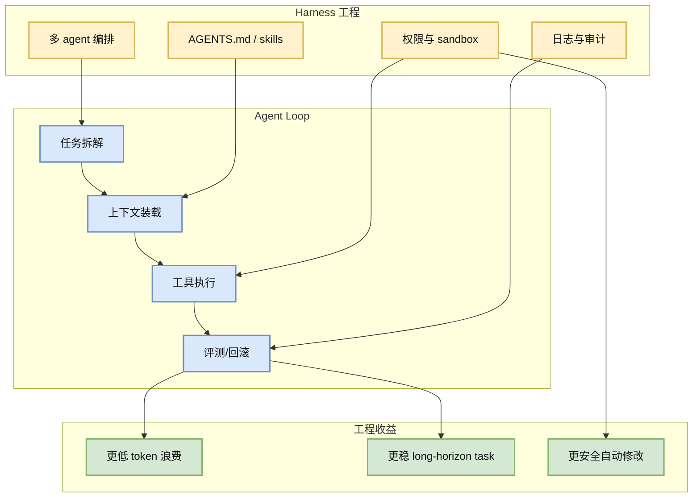
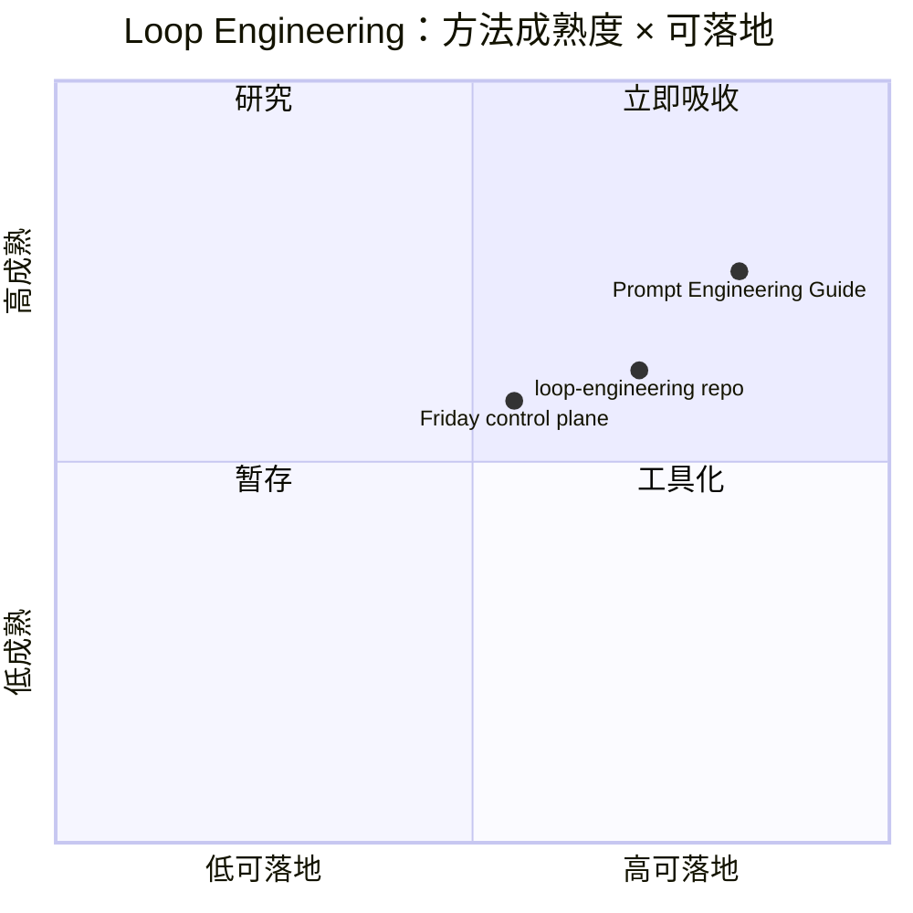

# Loop Engineer / Loop Engineering watchlist - 2026-07-02

> 类型：GitHub 主题  
> 返回日报：[[Daily/2026-07-02]]

## 一句话结论
今日 loop engineer 查询被 GitHub rate limit，使用 2026-06-30 成功 snapshot fallback；重点仍是 context engineering、AGENTS.md/harness、skills、eval loop、multi-agent orchestration。

## 信息压缩图示

### 辅助图：方法成熟度

## Loop Engineer GitHub 高 star Top 10
| 排名 | repo | stars | forks | language | updated_at | topics | 重点概括 | 是否值得试用 | Obsidian 详情 | 原文 |
|---:|---|---:|---:|---|---|---|---|---|---|---|
| 1 | dair-ai/Prompt-Engineering-Guide | 76088 | 8331 | MDX | 2026-06-30T09:43:12Z | agent, agents, ai-agents, chatgpt, deep-learning, generative-ai | 🐙 Guides, papers, lessons, notebooks and resources for prompt engineering, context engineering, ... | 值得试用 | [[GitHub/2026-07-02/loop-engineer-watchlist]] | [原文](https://github.com/dair-ai/Prompt-Engineering-Guide) |
| 2 | cobusgreyling/loop-engineering | 4244 | 553 | JavaScript | 2026-06-30T10:55:21Z | agentic-ai, ai-agents, ai-coding, anthropic, automation, claude | Practical patterns, starters & CLI tools for loop engineering with AI coding agents. Design syst... | 值得试用 | [[GitHub/2026-07-02/loop-engineer-watchlist]] | [原文](https://github.com/cobusgreyling/loop-engineering) |
| 3 | thesongzhu/Friday | 918 | 117 | TypeScript | 2026-06-30T10:46:46Z | agent-orchestration, agents, ai-agents, ai-assistant, approval-first, automation | Private control plane for AI agents | 值得试用 | [[GitHub/2026-07-02/loop-engineer-watchlist]] | [原文](https://github.com/thesongzhu/Friday) |

## Loop Engineer GitHub star 增长最快 Top 10
| 排名 | repo | stars_delta | stars | forks | language | updated_at | 增长依据 | 重点概括 | Obsidian 详情 | 原文 |
|---:|---|---:|---:|---:|---|---|---|---|---|---|
| 1 | dair-ai/Prompt-Engineering-Guide | 135 | 76088 | 8331 | MDX | 2026-06-30T09:43:12Z | historical_snapshot / 2026-06-30 broad fallback | 🐙 Guides, papers, lessons, notebooks and resources for prompt engineering, context engineering, ... | [[GitHub/2026-07-02/loop-engineer-watchlist]] | [原文](https://github.com/dair-ai/Prompt-Engineering-Guide) |
| 2 | thesongzhu/Friday | 1 | 918 | 117 | TypeScript | 2026-06-30T10:46:46Z | historical_snapshot / 2026-06-30 broad fallback | Private control plane for AI agents | [[GitHub/2026-07-02/loop-engineer-watchlist]] | [原文](https://github.com/thesongzhu/Friday) |
| 3 | cobusgreyling/loop-engineering | None | 4244 | 553 | JavaScript | 2026-06-30T10:55:21Z | historical_snapshot / 2026-06-30 broad fallback | Practical patterns, starters & CLI tools for loop engineering with AI coding agents. Design syst... | [[GitHub/2026-07-02/loop-engineer-watchlist]] | [原文](https://github.com/cobusgreyling/loop-engineering) |

## 对我的影响
| 维度 | 影响 | 建议动作 |
|---|---|---|
| AI coding workflow | Loop engineering 正在从 prompt 技巧变成 harness/skills/permissions 工程。 | 把任务模板、验收、回滚写进可复用 skill。 |
| Agent Eval | 需要真实工程迁移任务而非 toy benchmark。 | 关注 ScarfBench 类 benchmark。 |
| Infra | 多 agent 长任务需要日志、权限和状态管理。 | 继续沉淀 Hermes + Obsidian workflow。 |

## 可信度与局限性
- 今日 loop 查询被 403 rate limit 阻断，使用 6/30 fallback。
- fallback 只有 3 个明确主题 repo，不足 10 条，原因是严格主题过滤 + API 限制。

#ai-radar #loop-engineering #coding-agent
