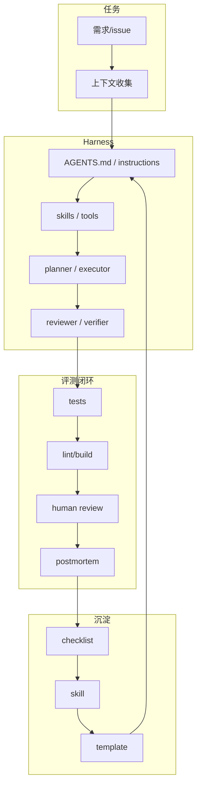

# Loop Engineer / Loop Engineering watchlist - 2026-07-03

> 类型：Loop Engineering watchlist  
> 返回日报：[[Daily/2026-07-03]]  
> 来源：2026-06-30 broad snapshot fallback；今日 loop GitHub API rate-limited。

## 一句话结论

今日 loop 查询受限，只能使用 fallback；但 context engineering、AGENTS.md、skills、eval loop、multi-agent orchestration 仍是 coding-agent 工作流的核心观察维度。

## High-star fallback

| repo | stars | 重点 | 原文 |
|---|---:|---|---|
| dair-ai/Prompt-Engineering-Guide | 76088 | Prompt/context engineering 资料库 | https://github.com/dair-ai/Prompt-Engineering-Guide |
| cobusgreyling/loop-engineering | 4244 | Practical patterns / starters / CLI tools for loop engineering | https://github.com/cobusgreyling/loop-engineering |
| thesongzhu/Friday | 918 | Private control plane for AI agents | https://github.com/thesongzhu/Friday |

## Growth fallback

| repo | stars_delta | 重点 | 原文 |
|---|---:|---|---|
| dair-ai/Prompt-Engineering-Guide | 135 | context/prompt learning resource | https://github.com/dair-ai/Prompt-Engineering-Guide |
| thesongzhu/Friday | 1 | agent control plane | https://github.com/thesongzhu/Friday |
| cobusgreyling/loop-engineering | None | loop engineering patterns | https://github.com/cobusgreyling/loop-engineering |

## Loop 结构图

## 今日建议

1. 不把 fallback 当作真实今日增长。
2. 用 Qwen Code / Cline 今日 release 做同题 eval，补齐 loop engineering 实证数据。
3. 明日 GitHub API 恢复后优先跑 `loop engineering`、`AGENTS.md harness`、`coding agent loop`。

## 标签

#ai-radar #loop-engineering #coding-agent #fallback
