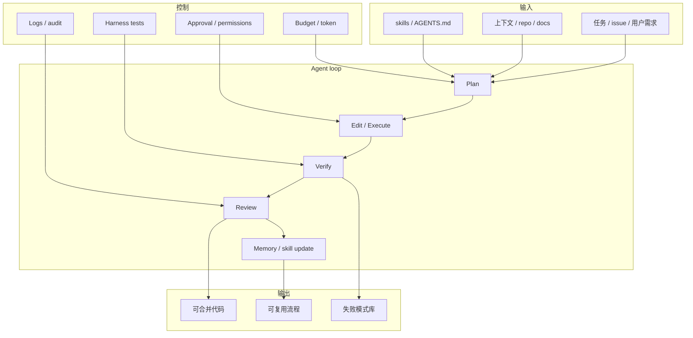

# Loop Engineer / Loop Engineering watchlist - 2026-07-04

> 类型：Loop Engineering / Coding Agent Loop 主题  
> 返回日报：[[Daily/2026-07-04]]  
> 来源：`Automation/state/github-stars-2026-07-04.json` + `Automation/state/github-stars-2026-06-30.json` fallback

## 一句话结论

今日 loop engineering 查询被 GitHub rate limit；主题榜使用 2026-06-30 成功 snapshot fallback，严格主题过滤后只有 3 个高相关 repo，需低置信但保留固定板块。

## Loop Engineer GitHub 高 star Top 10

| 排名 | repo | stars | forks | language | updated_at | topics | 重点概括 | 是否值得试用 | 原文 |
|---:|---|---:|---:|---|---|---|---|---|---|
| 1 | dair-ai/Prompt-Engineering-Guide | 76088 | 8331 | MDX | 2026-06-30T09:43:12Z | agent, agents, ai-agents, generative-ai | Prompt/context engineering 资料库，可作为 loop engineering 概念索引。 | 可 skim | https://github.com/dair-ai/Prompt-Engineering-Guide |
| 2 | cobusgreyling/loop-engineering | 4244 | 553 | JavaScript | 2026-06-30T10:55:21Z | agentic-ai, ai-agents, ai-coding, claude, codex, mcp | Practical loop engineering patterns / CLI / starters。 | 值得试用 | https://github.com/cobusgreyling/loop-engineering |
| 3 | thesongzhu/Friday | 918 | 117 | TypeScript | 2026-06-30T10:46:46Z | agent-orchestration, approval-first, automation | Private control plane for AI agents。 | 值得试用 | https://github.com/thesongzhu/Friday |

> 严格主题过滤后不足 10 条：今日 loop queries 403 rate limit，fallback 主题池较窄。

## Loop Engineer GitHub star 增长最快 Top 10

| 排名 | repo | stars_delta | stars | forks | language | updated_at | 增长依据 | 重点概括 | 原文 |
|---:|---|---:|---:|---:|---|---|---|---|---|
| 1 | dair-ai/Prompt-Engineering-Guide | 135 | 76088 | 8331 | MDX | 2026-06-30T09:43:12Z | historical_snapshot / 2026-06-30 broad fallback | Prompt/context engineering 资料库。 | https://github.com/dair-ai/Prompt-Engineering-Guide |
| 2 | thesongzhu/Friday | 1 | 918 | 117 | TypeScript | 2026-06-30T10:46:46Z | historical_snapshot / 2026-06-30 broad fallback | Agent control plane。 | https://github.com/thesongzhu/Friday |
| 3 | cobusgreyling/loop-engineering | None | 4244 | 553 | JavaScript | 2026-06-30T10:55:21Z | historical_snapshot / 2026-06-30 broad fallback | Loop engineering patterns / starters / CLI。 | https://github.com/cobusgreyling/loop-engineering |

## Loop Engineering 方法图

## 方法信号

| 标签 | 来源 | 标题 | 重点概括 | 对 AI coding 工作流的影响 | 原文 |
|---|---|---|---|---|---|
| 必读 | Coding Tools | Qwen Code v0.19.6 | 开源 CLI/TUI coding agent 继续迭代。 | 适合抽统一 CLI agent eval。 | https://github.com/QwenLM/qwen-code/releases/tag/v0.19.6 |
| 必读 | Coding Tools | Cline CLI v3.0.36 | Cline CLI 形态更新，IDE 与 CLI 边界变薄。 | 适合比较 Codex / Claude / Qwen / Cline 的权限与上下文。 | https://github.com/cline/cline/releases/tag/cli-v3.0.36 |
| 可 skim | GitHub | loop-engineering fallback watchlist | 使用历史 snapshot 保留 loop engineering 观察。 | 关注 context engineering、AGENTS.md、skills、eval loop 与 multi-agent orchestration。 | https://github.com/cobusgreyling/loop-engineering |

## 可信度与局限性

- 今日 loop 查询 403 rate limit；榜单来自 2026-06-30 fallback。
- `stars_delta=None` 表示历史 baseline 中没有对应 repo 或无法计算真实增长。
- 主题池不足 10 条，已在日报中明确原因。

## 标签

#ai-radar #loop-engineering #coding-agent #agent-loop #harness
