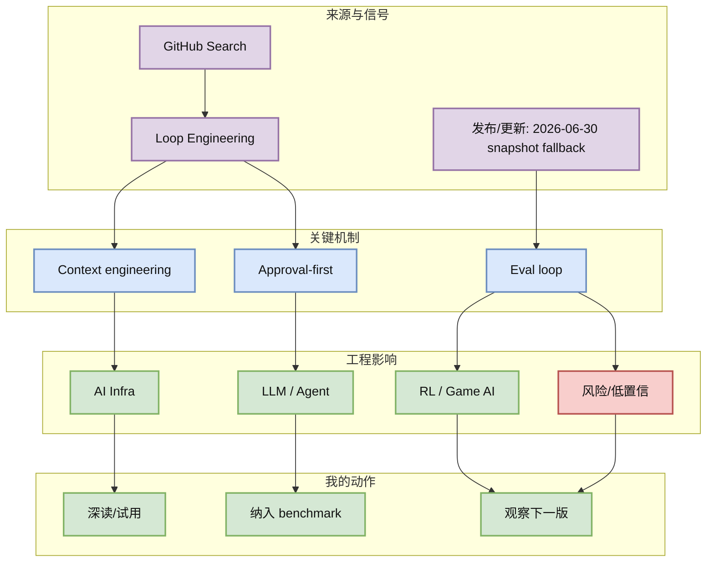
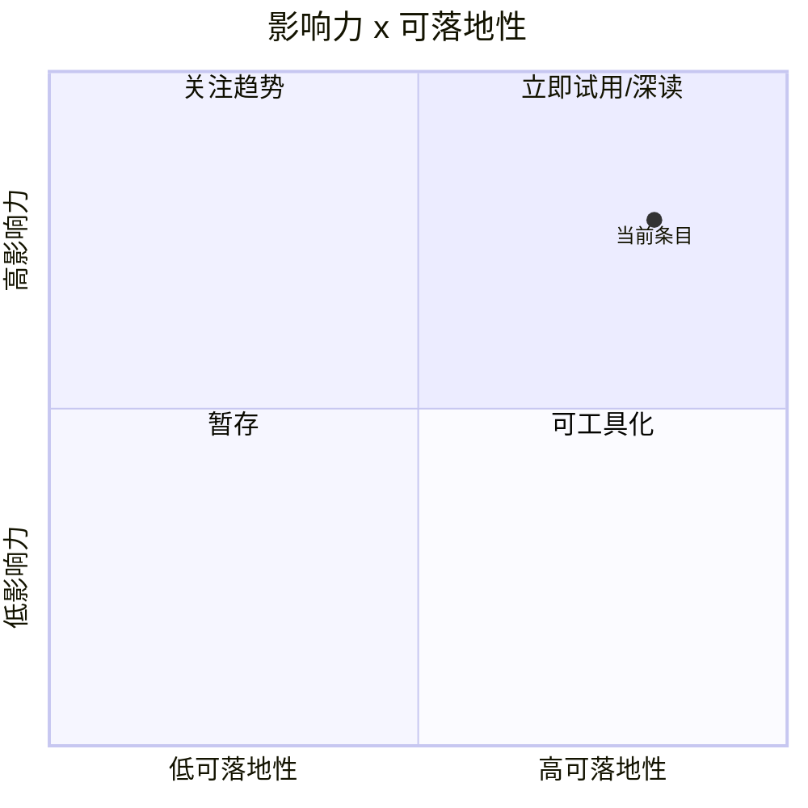

# Loop Engineer watchlist：context engineering、approval-first 与 agent harness

> 类型：GitHub 主题  
> 大类：GitHub  
> 小类：Loop Engineering  
> 推荐等级：后续  
> 创建日期：2026-07-05  
> 原文链接：https://github.com/search?q=loop+engineering&type=repositories  
> 网页详情：https://github.com/dyt27666-oss/AI-news-report-obsidians/blob/main/GitHub/LoopEngineer/2026-07-05/loop-engineer-watchlist.md  
> 返回日报：[[Daily/2026-07-05]]

## 一句话结论

Loop Engineering 今日 GitHub API 失败，使用 fallback 仍显示 context engineering、approval-first control plane 和 agent harness 是主线。

## TL;DR

- **它是什么**：Loop Engineer 主题 watchlist。
- **为什么重要**：coding agent 要从单次 prompt 变成可控循环，需要 context、approval、eval、回滚。
- **和我相关的点**：直接服务 Hermes/Codex/Claude 多 agent workflow。
- **建议动作**：抽象统一 harness checklist。

## 元信息

| 字段 | 内容 |
|---|---|
| 发布方/来源 | GitHub Search |
| 大厂/实验室 | GitHub Search |
| 栏目/来源类型 | Repository Snapshot / Fallback |
| 作者/机构 | GitHub Search |
| 发布时间 | 2026-06-30 snapshot fallback |
| 原文 | [原文](https://github.com/search?q=loop+engineering&type=repositories) |
| 代码 | https://github.com/search?q=loop+engineering&type=repositories |
| PDF | 未发现 |
| 标签 | #loop-engineering #coding-agent #harness |

## 信息压缩图示

### 主图：信号到行动

### 辅助图：影响力 x 可落地性

## 专业解读

Loop Engineering 今日 GitHub API 失败，使用 fallback 仍显示 context engineering、approval-first control plane 和 agent harness 是主线。 对用户最重要的不是“又一个更新”，而是它暴露了 agent/coding workflow 的真实工程接口：权限、上下文、工具调用、日志、远程执行、失败恢复和评测闭环。若这些接口稳定，就可以把单次 AI coding 变成可复现的 loop；若接口频繁变化，就需要在 harness 层做抽象，避免把业务流程绑死在某一个 IDE 或 CLI。

## 通俗解释

可以把这个条目理解成“AI 编程工具从聊天窗口继续走向自动化工作台”。真正有价值的是能否放进 tmux、CI、远程机器或 Obsidian 知识库流程里，而不是 demo 看起来多聪明。

## 关键机制拆解

| 机制 | 解决的问题 | 为什么有效 | 可能的坑 |
|---|---|---|---|
| Context engineering | 控制长任务上下文 | 减少 token 浪费和遗忘 | 可能过拟合工具 |
| Approval-first | 控制 agent 权限 | 降低误操作风险 | 会增加摩擦 |
| Eval loop | 让 agent 工作可回归 | 支持持续改进 | 指标难设计 |

## 对我的影响

| 维度 | 影响 | 建议动作 |
|---|---|---|
| AI Infra | harness 是 runtime 的控制平面。 | 设计通用 trace schema。 |
| LLM 工程 | 上下文工程决定长任务质量。 | 沉淀 prompt/context 模板。 |
| RL / Game AI | 可借鉴 episode/reward/replay 思路。 | 把 coding loop 视为环境。 |
| Agent / Eval | 核心主题。 | 建立 benchmark。 |

## 可信度与局限性

- 证据强度：来自公开 release/changelog/RSS/GitHub snapshot，可信度中等到高。
- 局限性：未逐条运行工具或复现代码，功能细节仍需本地验证。
- 潜在风险：release 标题不等于稳定 API；rate limit 导致 GitHub broad 数据使用 fallback。
- 还需要确认：许可、版本兼容、企业权限策略、日志可观测性。

## 我应该如何跟进

1. 把该条目加入 coding-agent 对照表：权限、上下文、MCP、CLI/TUI、远程执行、日志。
2. 用同一个小型 repo 做 30 分钟 smoke test，记录失败恢复路径。
3. 若能稳定运行，再纳入 Hermes/Codex/Claude Code 多 agent harness。

## 相关链接

- 原文：https://github.com/search?q=loop+engineering&type=repositories
- 网页详情：https://github.com/dyt27666-oss/AI-news-report-obsidians/blob/main/GitHub/LoopEngineer/2026-07-05/loop-engineer-watchlist.md
- 相关卡片：[[Daily/2026-07-05]]

## 标签

#ai-radar #loop-engineering #coding-agent #harness
