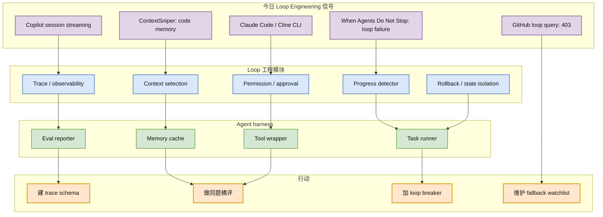

# Loop Engineer / Loop Engineering：今日 GitHub loop 查询 rate-limited，论文信号更强

> 类型：主题详情  
> 大类：GitHub / Loop Engineering / Coding Agent Workflow  
> 推荐等级：必读  
> 创建日期：2026-07-06  
> 原始来源：https://github.com/search?q=loop+engineering&type=repositories  
> 网页详情：https://github.com/dyt27666-oss/AI-news-report-obsidians/blob/main/GitHub/LoopEngineer/2026-07-06/loop-engineer-watchlist.md  
> 返回日报：[[Daily/2026-07-06]]

## 一句话结论

今日 GitHub loop engineering 查询被 rate limit，未得到新的主题 repo；但 ContextSniper、When Agents Do Not Stop、Stop Hand-Holding Your Coding Agent 等论文/方法信号共同说明 loop engineering 正在从口号变成 agent harness 工程问题。

## TL;DR

- **GitHub 状态**：今日 `theme_sections.loop_engineer` 为空，原因是 GitHub 403 rate limit。
- **fallback**：Loop Engineer repo 表使用 2026-06-30 broad snapshot 中的主题相关 repo。
- **强信号**：论文侧出现 context memory、infinite loops、coding-agent loop engineering 等高相关主题。
- **建议动作**：把 loop engineering 拆成 trace、context、permission、progress、rollback 五个工程模块。

## 元信息

| 字段 | 内容 |
|---|---|
| 来源 | GitHub Search API / arXiv |
| 来源类型 | Repository metadata + 论文索引 |
| 今日 loop GitHub repo 数 | 0（rate-limited） |
| fallback snapshot | `Automation/state/github-stars-2026-06-30.json` |
| 代表论文 | ContextSniper / When Agents Do Not Stop / Stop Hand-Holding Your Coding Agent |
| 原文 | https://github.com/search?q=loop+engineering&type=repositories |

## 信息压缩图示

## Loop Engineer fallback repo 表

| repo | stars | forks | 语言 | 价值 | 原文 |
|---|---:|---:|---|---|---|
| dair-ai/Prompt-Engineering-Guide | 76088 | 8331 | MDX | prompt/context engineering 知识库，可作为 loop 概念索引 | https://github.com/dair-ai/Prompt-Engineering-Guide |
| cobusgreyling/loop-engineering | 4244 | 553 | JavaScript | practical loop engineering patterns / CLI / templates | https://github.com/cobusgreyling/loop-engineering |
| thesongzhu/Friday | 918 | 117 | TypeScript | private control plane for AI agents，强调 approval-first workflow | https://github.com/thesongzhu/Friday |

## Loop Engineering 模块化拆解

| 模块 | 目标 | 今日对应信号 |
|---|---|---|
| Context selection | 每步只给必要证据 | ContextSniper |
| Trace / observability | 记录 agent 做了什么 | GitHub Copilot session streaming |
| Permission / approval | 控制写入和高风险命令 | Claude Code / Cline / Friday |
| Progress detector | 防止无进展循环 | When Agents Do Not Stop |
| Rollback / state isolation | 避免 repo 被污染 | Persistent-state safety / git workspace |

## 专业解读

Loop Engineering 不应被理解成“更会写 prompt”。它更像 agent runtime 的软件工程：如何组织上下文，如何让工具调用可审计，如何定义进展，如何在没有进展时停止，如何在失败后回滚，如何让多 agent 协作不互相污染状态。今日 GitHub 主题查询失败，但论文和工具侧信号反而更有价值，因为它们分别补齐了 context memory、loop failure、session trace 和 CLI runtime。

对用户的工作流来说，下一步不是找一个神奇 agent，而是定义统一 harness：同一任务、同一 repo、同一权限、同一 trace schema。这样 Claude Code、Codex、Cline、Qwen Code 才能被公平比较。

## 通俗解释

Loop Engineering 就像给 AI 编程助手设计“工作制度”：它该看什么资料、能做什么操作、多久汇报一次、什么时候停止、出错怎么回滚。没有这些制度，agent 越强越可能把事情弄乱。

## 对我的影响

| 维度 | 影响 | 建议动作 |
|---|---|---|
| AI coding workflow | 从 prompt 转向 harness 设计 | 建立固定横评任务集 |
| AI Infra | agent runner 需要控制面 | 加 trace、budget、permission、rollback |
| Eval | 成功率之外要看过程质量 | 加 context precision / loop rate |
| 团队协作 | 多 agent 容易状态污染 | 使用独立 worktree 和审批门 |

## 可信度与局限性

- 今日 loop GitHub 主题查询失败，repo 表为 fallback。
- 论文信号来自 arXiv 摘要，仍需读 PDF。
- “Loop Engineering”作为术语仍在形成期，需要避免被营销化。

## 我应该如何跟进

1. 建 agent trace schema：context、tool、diff、test、approval、cost、rollback。
2. 给 Codex / Claude Code / Cline / Qwen Code 跑同题 benchmark。
3. 增加 progress detector 和 loop breaker，避免无限 agentic loop。

## 相关链接

- GitHub search：https://github.com/search?q=loop+engineering&type=repositories
- ContextSniper：[[Papers/2026-07-06/contextsniper-token-efficient-code-memory]]
- When Agents Do Not Stop：[[Papers/2026-07-06/when-agents-do-not-stop]]
- 返回：[[Daily/2026-07-06]]

## 标签

#ai-radar #loop-engineering #coding-agent #agent-loop
