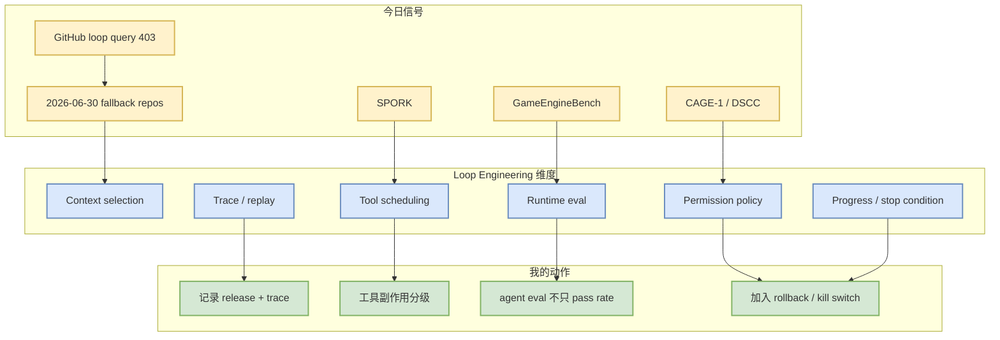

# Loop Engineer / Loop Engineering Watchlist - 2026-07-07

> 日期：2026-07-07  
> 来源类型：GitHub snapshot fallback + arXiv paper signals  
> 原文：https://github.com/search?q=loop+engineering&type=repositories

## 一句话结论

今日 Loop Engineer GitHub 主题查询被 403 rate limit 打断，GitHub 表使用 2026-06-30 fallback；论文侧 GameEngineBench、SPORK、CAGE-1/DSCC 给出更强的方法信号。

## TL;DR

- 今日 `theme_sections.loop_engineer` 为空，不能硬造今日 GitHub 热榜。
- fallback repo：Prompt-Engineering-Guide、cobusgreyling/loop-engineering、Friday。
- 今日更有价值的是论文信号：复杂 runtime eval、agent inference latency hiding、governance/policy control。
- 对 AI coding workflow：loop engineering 应关注 trace、permission、progress、rollback、budget 和 eval。

## 信息压缩图示

## GitHub fallback candidates

| repo | stars | stars_delta | language | 重点 | 原文 |
|---|---:|---:|---|---|---|
| dair-ai/Prompt-Engineering-Guide | 76088 | 135 | MDX | prompt/context engineering 资料库 | https://github.com/dair-ai/Prompt-Engineering-Guide |
| cobusgreyling/loop-engineering | 4244 | - | JavaScript | practical loop engineering patterns | https://github.com/cobusgreyling/loop-engineering |
| thesongzhu/Friday | 918 | 1 | TypeScript | private control plane for AI agents | https://github.com/thesongzhu/Friday |

## 今日方法信号

| 来源 | 标题 | 对 loop engineering 的含义 |
|---|---|---|
| arXiv | GameEngineBench | 复杂 runtime eval，考验 agent 在 C++/UE5 状态环境中的 loop 能力 |
| arXiv | SPORK | tool-call wait 可以被 serving scheduler 和 speculative execution 优化 |
| arXiv | CAGE-1 | enterprise agent 需要 control、assurance、governance eval |
| arXiv | DSCC | 多工具链要动态组合权限策略，单工具许可不等于组合许可 |

## 专业解读

Loop Engineering 的核心不是多调用几次 LLM，而是让每个循环都有可验证状态：为什么选这个上下文、为什么调用这个工具、是否有进展、是否允许执行、失败能否回滚。今日论文信号比 GitHub repo 更强，尤其是 SPORK 把 tool latency 纳入 serving，CAGE/DSCC 把权限纳入 runtime control。

## 对我的影响

- coding agent 横评要记录完整 loop trace。
- 对每个 tool 定义 side-effect class：read-only、sandbox write、external write、destructive。
- 加入 progress detector：重复搜索、重复报错、无新增证据时触发 stop/ask/replan。
- 对 tmux 多 agent 增加统一 event schema。

## 可信度与局限性

- GitHub 部分低置信：今日主题查询 403，只能 fallback。
- 论文部分中高置信：来自 arXiv，但需读全文确认可复现性。

## 我应该如何跟进

1. 恢复 authenticated GitHub broad/loop 查询。
2. 把 GameEngineBench/SPORK/CAGE/DSCC 加入 coding-agent eval reading list。
3. 制定 agent loop trace schema。

## 相关链接

- GitHub loop search：https://github.com/search?q=loop+engineering&type=repositories
- GameEngineBench：https://arxiv.org/abs/2607.03525v1
- SPORK：https://arxiv.org/abs/2607.03333v1
- CAGE-1：https://arxiv.org/abs/2607.03510v1
- DSCC：https://arxiv.org/abs/2607.03423v1

#ai-radar #loop-engineering #coding-agent #eval #agent-runtime
