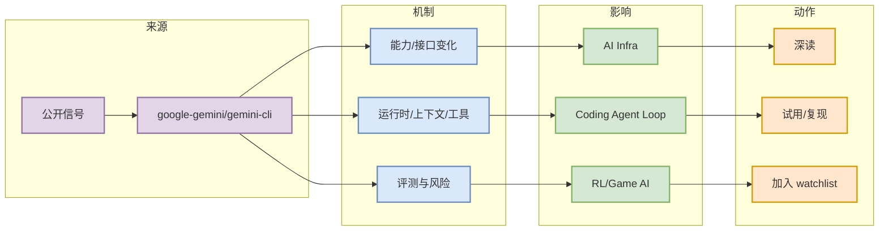

# google-gemini/gemini-cli

> 日期：2026-07-11
> 类型：Loop Engineer GitHub Repo
> 原文：https://github.com/google-gemini/gemini-cli

## 一句话结论

开源终端 agent 路线，适合对比 Claude Code/Codex 的 sandbox、tool calling 与 IDE 生态。

## TL;DR

- 核心信号：开源终端 agent 路线，适合对比 Claude Code/Codex 的 sandbox、tool calling 与 IDE 生态。
- 对我的价值：判断它是否改变 runtime、tool calling、eval harness、post-training 或业务仿真的实现路径。
- 建议动作：加入观察列表，必要时拉取 README/release notes 做二次验证。

## 元信息表

| 字段 | 内容 |
|---|---|
| 来源类型 | Loop Engineer GitHub Repo |
| 原文 | https://github.com/google-gemini/gemini-cli |
| 当天日报 | [[Daily/2026-07-11]] |

## 信息压缩图

## 影响矩阵

| 维度 | 判断 | 说明 |
|---|---|---|
| 工程落地 | 中到高 | 需要确认 README、release notes 和实际代码变更。 |
| 可信度 | 中 | 来自公开来源；部分来源受 rate limit 影响。 |
| 风险 | 中 | 不能只看标题，需要验证 benchmark、依赖和可复现性。 |

## 专业解读

开源终端 agent 路线，适合对比 Claude Code/Codex 的 sandbox、tool calling 与 IDE 生态。 对 AI Infra 工程师的意义在于，它可能改变工具链、模型运行时、agent loop 或业务仿真构建方式。

## 通俗解释

这是一个值得放进观察列表的工程信号；强相关时深读，低 star/低置信时只抽取思路。

## 我应该如何跟进

1. 阅读原文和 README/release notes。
2. 对工具类项目，和 Claude Code / Codex / Cline / Continue 做横向对比。
3. 对 Infra/RL 项目，记录 benchmark、依赖和可复现实验。

#ai-radar #detail
