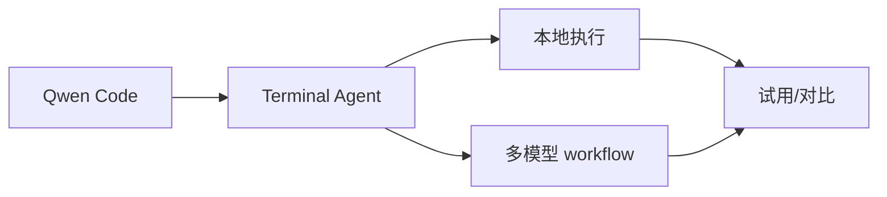

# qwenlm-qwen-code

> 日期：2026-07-11
> 类型：补充 watchlist 详情
> 当天日报：[[Daily/2026-07-11]]

## 一句话结论

Qwen Code 是国产开源 terminal coding agent，适合纳入多模型、多供应商 coding workflow 对比。

## TL;DR

- 来源：GitHub release / repo watchlist。
- 价值：对比 Claude Code、Codex、Gemini CLI 的权限、上下文和本地执行模式。
- 可信度：中，来自 direct watched repo fallback 或固定 watchlist。

## 信息压缩图

## 后续动作

1. 阅读 release notes。
2. 和 Codex / Claude Code 做同任务对比。
3. 记录权限、上下文、patch workflow 差异。

#ai-radar #detail
