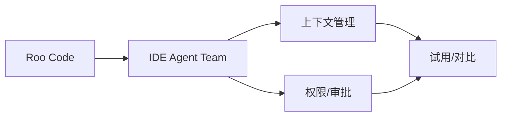

# roo-codeinc-roo-code

> 日期：2026-07-11
> 类型：补充 watchlist 详情
> 当天日报：[[Daily/2026-07-11]]

## 一句话结论

Roo Code 是编辑器内多 agent coding workflow 候选，适合和 Cline / Continue 做权限与上下文对比。

## TL;DR

- 来源：GitHub release / repo watchlist。
- 价值：观察 VS Code 内 agent team、任务拆分、工具调用和审批模式。
- 可信度：中，来自 direct watched repo fallback 或固定 watchlist。

## 信息压缩图

## 后续动作

1. 阅读 release notes。
2. 和 Cline / Continue 做同任务对比。
3. 记录权限、上下文、工具调用差异。

#ai-radar #detail
