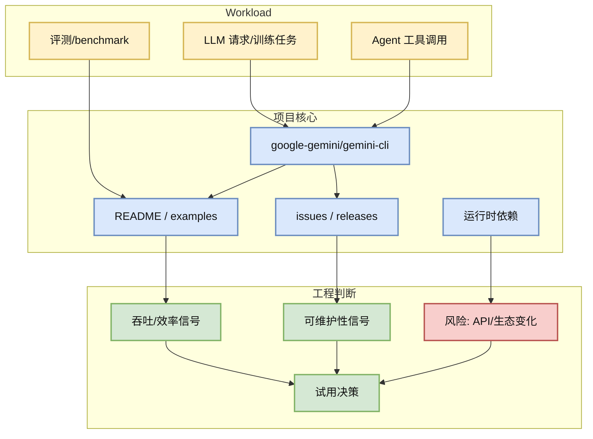
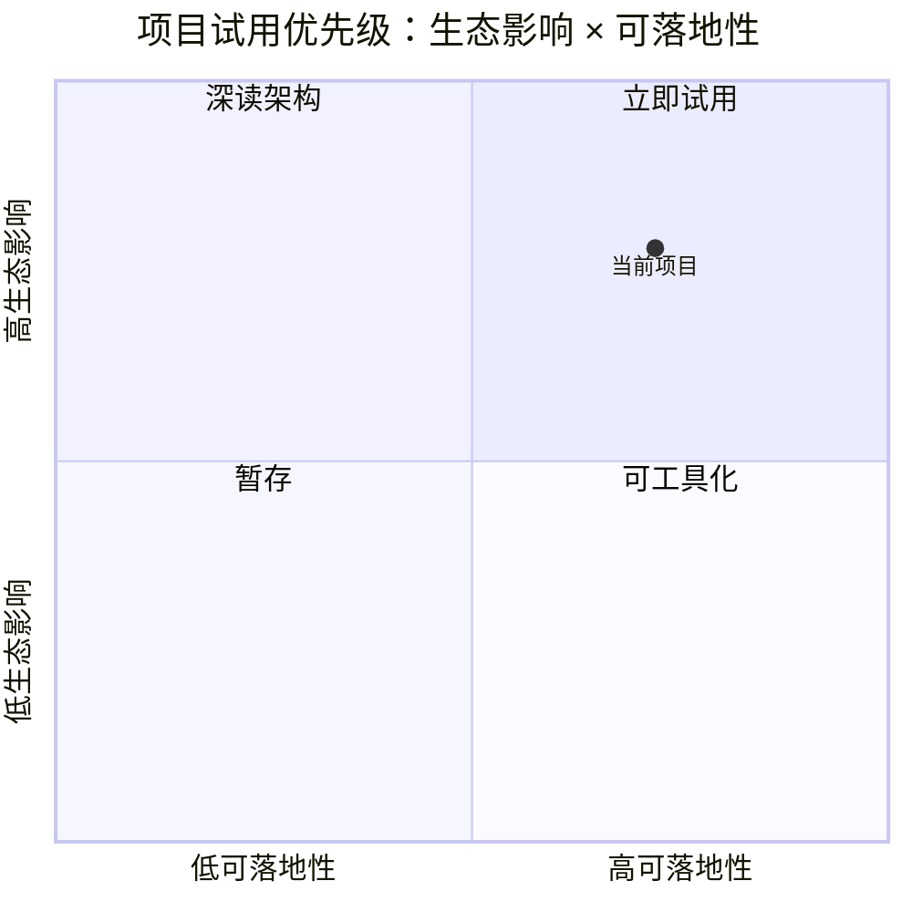

# Loop Engineer 项目: google-gemini/gemini-cli

> 类型：GitHub 项目
> 大类：GitHub
> 小类：LoopEngineer
> 推荐等级：可 skim
> 创建日期：2026-07-26
> 原文链接：https://github.com/google-gemini/gemini-cli
> 网页详情：https://github.com/dyt27666-oss/AI-news-report-obsidians/blob/main/GitHub/LoopEngineer/2026-07-26/google-gemini-gemini-cli.md
> 返回日报：[[Daily/2026-07-26]]

## 一句话结论

google-gemini/gemini-cli 是今日 direct watched-repo fallback 中的高信号项目，当前 106176 stars，适合放入 AI Infra / coding-agent 工程观察池。

## TL;DR

- **它是什么**：An open-source AI agent that brings the power of Gemini directly into your terminal.
- **为什么重要**：它处在 serving、training、agent loop 或工具链的关键依赖层，能反映真实工程社区关注点。
- **和我相关的点**：可用于评估推理服务、训练基础设施、agent 工作流或代码自动化环节是否有可复用组件。
- **建议动作**：先看 README、examples、issues 中的生产约束，再决定是否本地试用。

## 元信息

| 字段 | 内容 |
|---|---|
| repo | [google-gemini/gemini-cli](https://github.com/google-gemini/gemini-cli) |
| stars / forks | 106176 / 14312 |
| language | TypeScript |
| updated_at | 2026-07-26T01:02:20Z |
| pushed_at | 2026-07-25T01:24:18Z |
| topics | ai, ai-agents, cli, gemini, gemini-api, mcp-client, mcp-server |
| 来源类型 | GitHub direct repo GET fallback |

## 信息压缩图示

## 专业解读

该条目来自 direct repo GET，而不是完整 GitHub Search 排名；因此适合做稳定 watchlist，而不应被解释为今日全站增长榜。对 AI Infra 工程来说，重点不是 stars 本身，而是它是否覆盖 scheduler、runtime、cache、distributed training、agent orchestration、IDE/CLI loop 等可迁移组件。

## 通俗解释

把它当成一个“工程雷达上的固定点”：每天看它有没有版本、文档、issue 或社区热度变化，用来判断某条技术路线是否正在升温。

## 关键机制拆解

| 机制 | 解决的问题 | 为什么有效 | 可能的坑 |
|---|---|---|---|
| GitHub 元数据 | 快速判断生态热度 | stars/forks/update 是低成本信号 | 不能替代代码审查 |
| README/examples | 判断落地难度 | 示例越完整越容易试用 | 示例可能滞后 |
| releases/issues | 判断维护活跃度 | 版本和 issue 反映真实用户反馈 | release 频率不等于质量 |

## 对我的影响

| 维度 | 影响 | 建议动作 |
|---|---|---|
| AI Infra | 可作为 serving/training/agent 基础设施候选 | 先检查 benchmark 和部署路径 |
| LLM 工程 | 可观察上下文、工具调用、推理框架变化 | 跟踪 README 和 release notes |
| RL / Game AI | 若涉及训练/环境/agent，可迁移到自博弈或评测 loop | 只复用抽象，不盲目套框架 |
| Agent / Eval | 可作为 loop engineering 参考 | 加入 coding-agent watchlist |

## 可信度与局限性

- 证据强度：中等，来自 GitHub API direct repo metadata。
- 局限性：GitHub Search 今日被 403 限流，榜单不是完整全站搜索。
- 潜在风险：stars_delta 对部分 repo 可能缺少历史 baseline。
- 还需要确认：README、license、benchmark、release 是否满足生产使用。

## 我应该如何跟进

1. 打开原 repo 看 README/examples。
2. 若和当前任务相关，拉取最小 demo 试跑。
3. 将稳定有用的组件加入长期 watchlist。

## 相关链接

- 原文：https://github.com/google-gemini/gemini-cli
- 网页详情：https://github.com/dyt27666-oss/AI-news-report-obsidians/blob/main/GitHub/LoopEngineer/2026-07-26/google-gemini-gemini-cli.md
- 返回日报：[[Daily/2026-07-26]]

## 标签

#ai-radar #github #LoopEngineer
