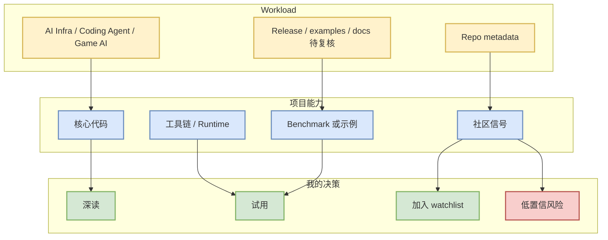

# openai/codex - 2026-08-04

> 一句话结论：这是 coding-agent loop / MCP / CLI agent / eval harness 方向的核心 watched repo。

## TL;DR

- 来源类型：GitHub repo metadata / direct watched-repo fallback。
- 今日状态：GitHub Search 403 后直接读取 `/repos/{owner}/{repo}`，因此这是 watched set 信号，不是完整全网 ranking。
- 对用户价值：这是 coding-agent loop / MCP / CLI agent / eval harness 方向的核心 watched repo。
- 建议动作：比较权限、上下文、MCP、远程执行和多 agent orchestration。

## 元信息

| 字段 | 值 |
|---|---|
| repo | `openai/codex` |
| stars | 103645 |
| forks | 15651 |
| language | Rust |
| updated_at | 2026-08-04T01:04:00Z |
| topics | 无 |
| 来源类型 | GitHub Repo / Direct API fallback |
| 原文 | https://github.com/openai/codex |

## 信息压缩图示

## 机制 / 影响矩阵

| 维度 | 观察 | 判断 |
|---|---|---|
| 工程相关性 | Lightweight coding agent that runs in your terminal | 强相关，可作为今日 watchlist |
| 生产可用性 | 需要看 docs、examples、issue/release 活跃度 | 不直接引入生产，先做最小试用 |
| 对 AI Infra | 关注 serving/training/runtime/eval/agent loop 可复用点 | 可映射到工程选型 |
| 对 RL/Game AI | 若涉及 Rummy / self-play / evaluator，可抽状态机和 rollout 接口 | 先做 sandbox 复现 |

## 专业解读

这是 coding-agent loop / MCP / CLI agent / eval harness 方向的核心 watched repo。 当前条目来自直接 repo 元数据或 snapshot 补齐，适合做工程 radar，而不是宣称今天全网新爆发。需要结合 release notes、benchmark、examples 再判断是否进入试用。

## 通俗解释

这条记录的意义是：它在用户关注的 AI Infra、coding agent 或 Rummy/Game AI 方向上足够接近，可以先放进观察清单；但由于 GitHub Search 今日限流，增长排序需要保守看待。

## 我应该如何跟进

1. 打开原 repo 看 README、release、examples。
2. 若是 serving/training 项目，重点看 scheduler、KV cache、CUDA/Triton、benchmark。
3. 若是 coding agent，重点看权限、上下文、MCP、远程执行、CLI/TUI。
4. 若是 Rummy，重点看规则状态机、action space、reward、self-play evaluator。

## 可信度与局限性

- 可信度：中。repo 元数据直接来自 GitHub API；但 Search API 已 403，榜单不是全网完整排序。
- 局限：没有自动验证代码质量、release diff 和 benchmark。

## 相关链接

- 原文：https://github.com/openai/codex
- 今日日报：[[Daily/2026-08-04]]

#ai-radar #github #watchlist
