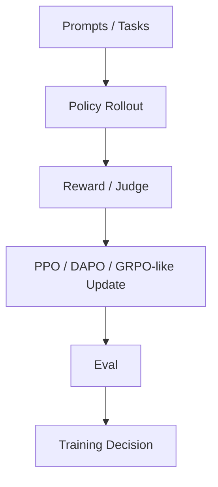

# OpenRLHF/OpenRLHF

> 日期：2026-08-08  
> 来源：GitHub direct watched repo fallback  
> 原文：https://github.com/OpenRLHF/OpenRLHF

## 一句话结论
OpenRLHF 是 RLHF / agentic RL 训练框架观察项，可连接 post-training 与 Loop Engineering 评测闭环。

## 影响矩阵
| 维度 | 判断 | 跟进 |
|---|---|---|
| Post-training | 高 | 检查算法与 Ray scaling |
| Agent eval | 中 | 可接入 coding/game tasks |
| 业务迁移 | 中 | 可借鉴到 Rummy self-play 评测 |

#ai-radar #rlhf #loop-engineering
