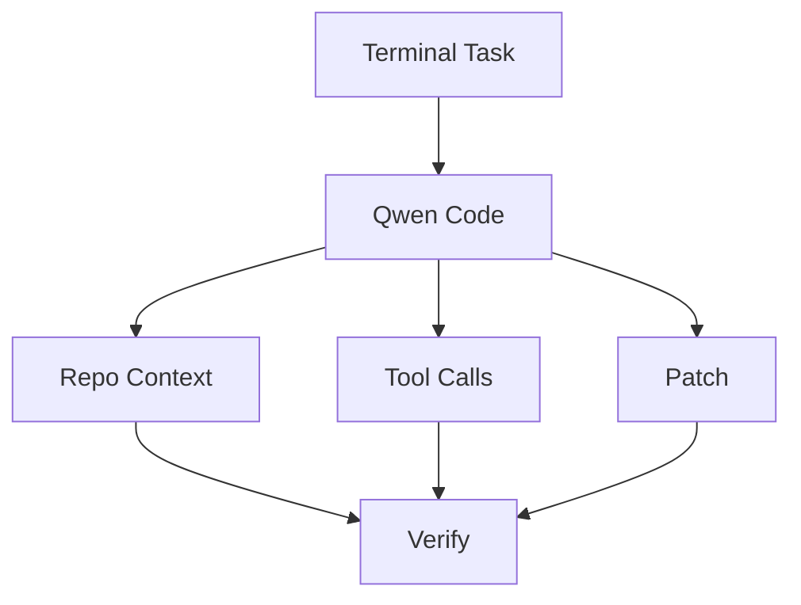

# QwenLM/qwen-code

> 日期：2026-08-08  
> 来源：GitHub direct watched repo fallback  
> 原文：https://github.com/QwenLM/qwen-code

## 一句话结论
Qwen Code 是国产/开源 coding-agent CLI 的重要观察项，今日 release 源显示 v0.21.7。

## 影响矩阵
| 维度 | 判断 | 跟进 |
|---|---|---|
| Coding agent | 高 | 读 v0.21.7 release |
| 多模型生态 | 高 | 与 Codex / Claude Code 对比 |
| 风险 | 中 | 确认权限和执行边界 |

#ai-radar #loop-engineering #qwen-code
