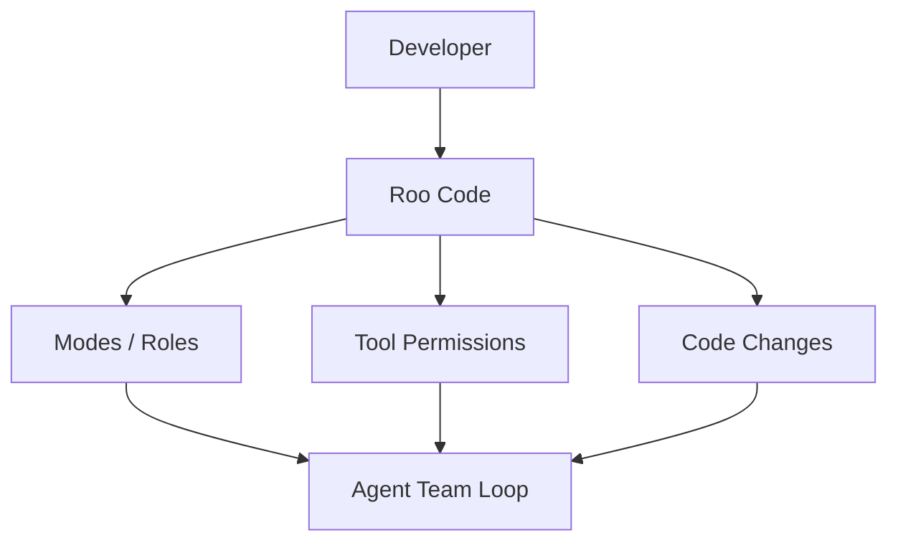

# RooCodeInc/Roo-Code

> 日期：2026-08-08  
> 来源：GitHub direct watched repo fallback  
> 原文：https://github.com/RooCodeInc/Roo-Code

## 一句话结论
Roo Code 代表 IDE 内多 agent / dev team 式 coding assistant，适合观察 role、mode、权限和上下文策略。

## 跟进建议
人工确认最新 release 与权限、MCP、上下文窗口和团队协作模式是否相关。

#ai-radar #loop-engineering #roo-code
