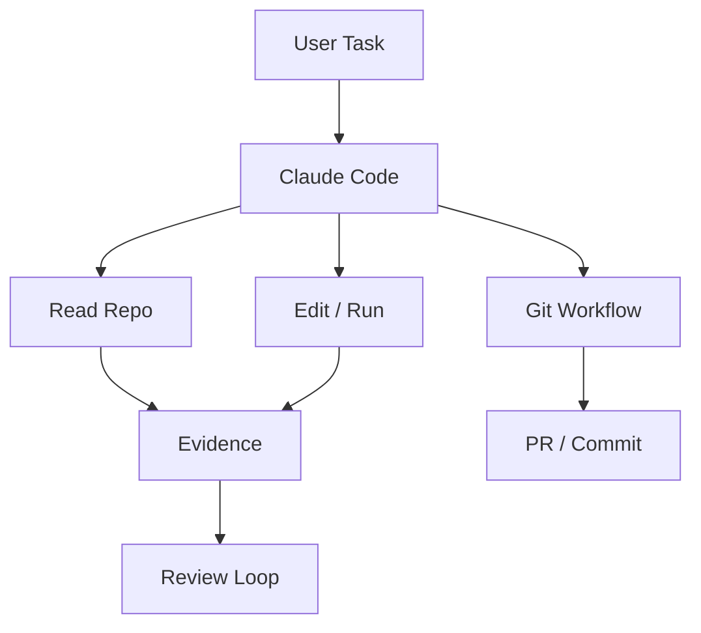

# anthropics/claude-code

> 日期：2026-08-08  
> 来源：GitHub / Anthropic  
> 原文：https://github.com/anthropics/claude-code

## 一句话结论
Claude Code 是今日 Loop Engineer 高 star 锚点，代表终端内 coding agent 的主流交互形态。

## TL;DR
- 关注点：CLI/TUI、权限、工具调用、git workflow、上下文管理。
- 价值：直接影响多 agent 编程、代码审查和长期任务执行方式。
- 局限：需读 release notes 确认 v2.1.224 的功能细节。

## 影响矩阵
| 维度 | 判断 | 跟进 |
|---|---|---|
| Coding Agent | 高 | 跟踪权限和上下文窗口 |
| Loop Engineering | 高 | 提炼任务分解和验证证据模式 |
| 风险 | 中 | 防止无约束自动执行 |

#ai-radar #loop-engineering #claude-code
