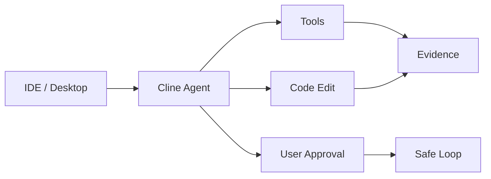

# cline/cline

> 日期：2026-08-08  
> 来源：GitHub / Cline  
> 原文：https://github.com/cline/cline

## 一句话结论
Cline 是 IDE/CLI autonomous coding agent 的高 star 项，值得跟踪其桌面端和插件能力。

## 影响矩阵
| 维度 | 判断 | 跟进 |
|---|---|---|
| Coding workflow | 高 | 关注 desktop-v0.0.10 |
| 权限控制 | 高 | 检查工具调用边界 |
| 复用价值 | 中 | 与 Roo / Continue 对比 |

#ai-radar #loop-engineering #cline
