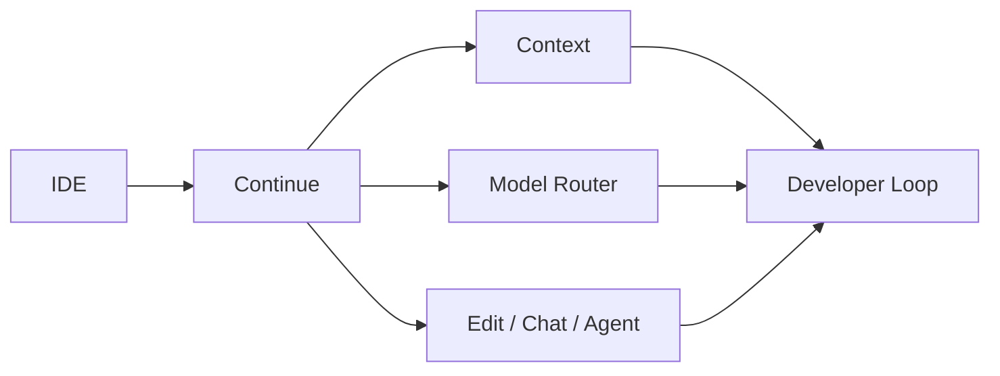

# continuedev/continue

> 日期：2026-08-08  
> 来源：GitHub direct watched repo fallback  
> 原文：https://github.com/continuedev/continue

## 一句话结论
Continue 是开源 coding agent / IDE assistant，适合观察本地化、模型路由和开发者工作流集成。

## 跟进建议
与 Cline、Roo、Cursor 对比 agent mode、上下文构建、模型路由和团队部署能力。

#ai-radar #loop-engineering #continue
