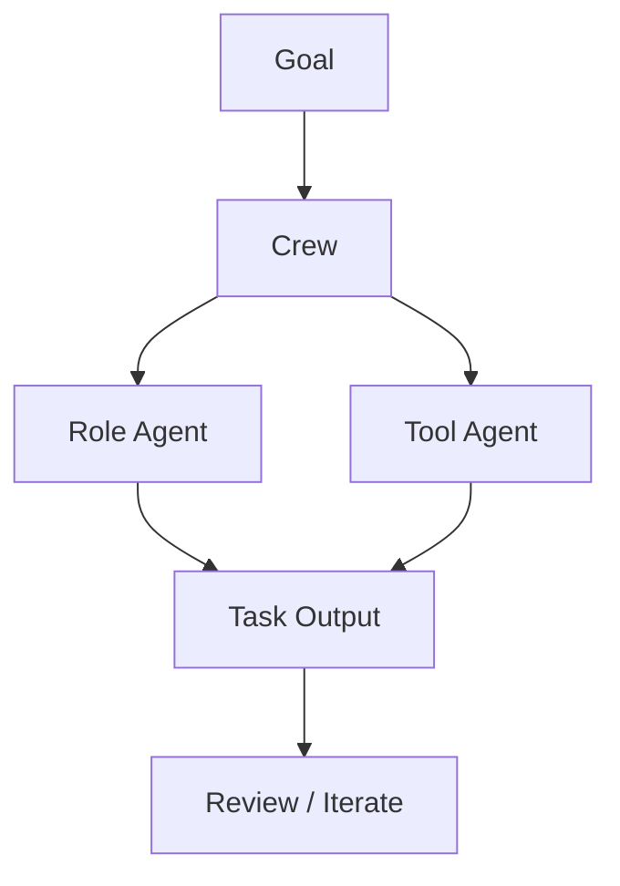

# crewAIInc/crewAI

> 日期：2026-08-08  
> 来源：GitHub direct watched repo fallback  
> 原文：https://github.com/crewAIInc/crewAI

## 一句话结论
CrewAI 是 role-playing multi-agent 编排框架，今日在 watched repo 增长中保持高信号。

## 影响矩阵
| 维度 | 判断 | 跟进 |
|---|---|---|
| Multi-agent | 高 | 检查 task/role 抽象 |
| Coding loop | 中 | 看是否适合代码任务闭环 |
| 风险 | 中 | 避免复杂编排掩盖验证不足 |

#ai-radar #loop-engineering #agent
