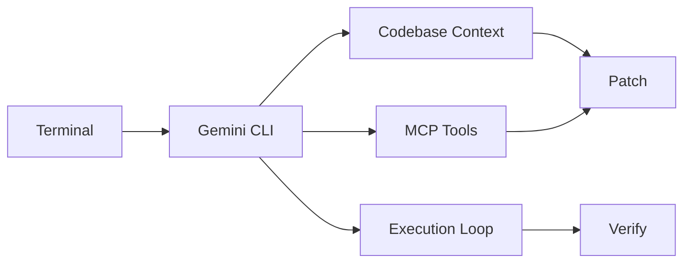

# google-gemini/gemini-cli

> 日期：2026-08-08  
> 来源：GitHub / Google  
> 原文：https://github.com/google-gemini/gemini-cli

## 一句话结论
Gemini CLI 是 open-source 终端 agent 的高 star 观察项，适合与 Claude Code / Codex 对比。

## TL;DR
- 关注点：CLI agent、MCP client/server、IDE/terminal workflow。
- 价值：可作为多模型 coding-agent loop 的替代/补充入口。
- 局限：需要人工验证 release v0.54.4 的实际变化。

## 跟进建议
对比 Gemini CLI、Codex、Claude Code 在工具权限、MCP、上下文和验证闭环上的差异。

#ai-radar #loop-engineering #gemini-cli
