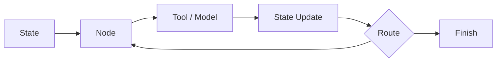

# langchain-ai/langgraph

> 日期：2026-08-08  
> 来源：GitHub direct watched repo fallback  
> 原文：https://github.com/langchain-ai/langgraph

## 一句话结论
LangGraph 是 resilient agent workflow 的关键框架，适合研究状态机式 agent loop。

## 影响矩阵
| 维度 | 判断 | 跟进 |
|---|---|---|
| Agent state | 高 | 研究 graph/state abstraction |
| Eval loop | 中 | 接入验证节点 |
| 生产化 | 高 | 关注恢复、重试和可观测性 |

#ai-radar #loop-engineering #langgraph
