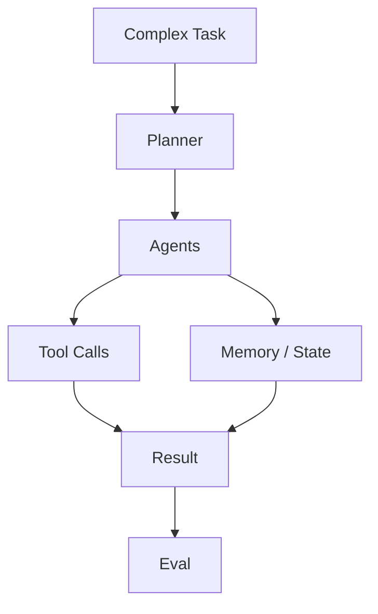

# microsoft/autogen

> 日期：2026-08-08  
> 来源：GitHub / Microsoft  
> 原文：https://github.com/microsoft/autogen

## 一句话结论
AutoGen 是多 agent 编排的经典高 star 框架，可作为 Loop Engineering 架构参考。

## 影响矩阵
| 维度 | 判断 | 跟进 |
|---|---|---|
| Multi-agent | 高 | 对比 CrewAI / LangGraph |
| Eval loop | 中 | 检查可观测性和控制流 |
| 生产风险 | 中 | 控制状态膨胀和权限 |

#ai-radar #loop-engineering #autogen
