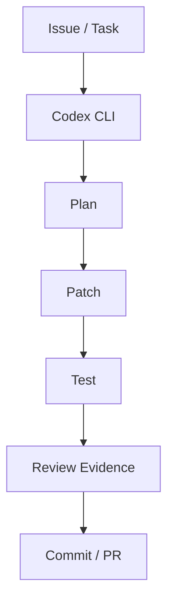

# openai/codex

> 日期：2026-08-08  
> 来源：GitHub / OpenAI  
> 原文：https://github.com/openai/codex

## 一句话结论
Codex 今日在增长榜中继续靠前，是 terminal coding-agent workflow 的核心观察对象。

## TL;DR
- 最新 release 源：rust-v0.147.0。
- 关注点：CLI/TUI、sandbox、approval、上下文、远程执行、review loop。
- 价值：直接影响 AI Infra 工程日常开发和多 agent 编排。

## 影响矩阵
| 维度 | 判断 | 跟进 |
|---|---|---|
| AI coding | 高 | 读 rust-v0.147.0 changelog |
| Loop Engineering | 高 | 对比验证/审批机制 |
| 风险 | 中 | 注意自动执行和 sandbox 边界 |

#ai-radar #loop-engineering #codex
