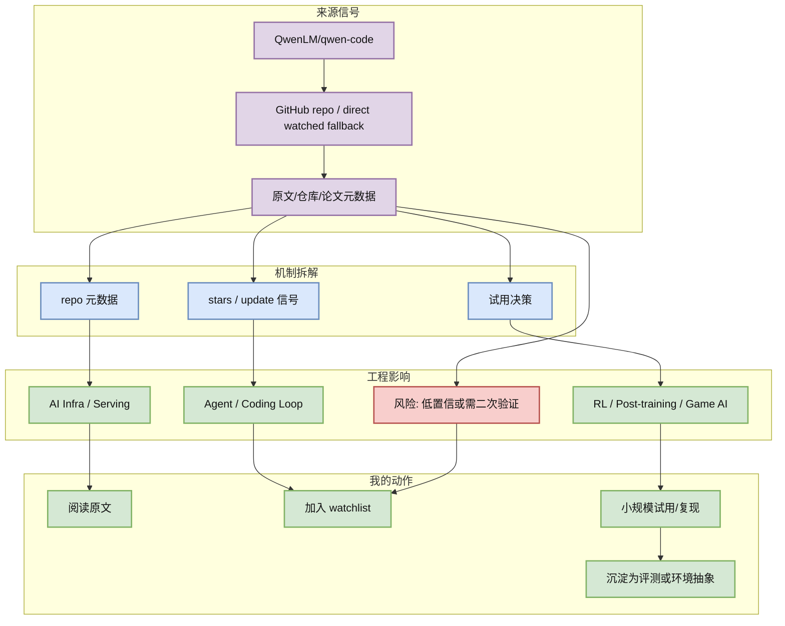
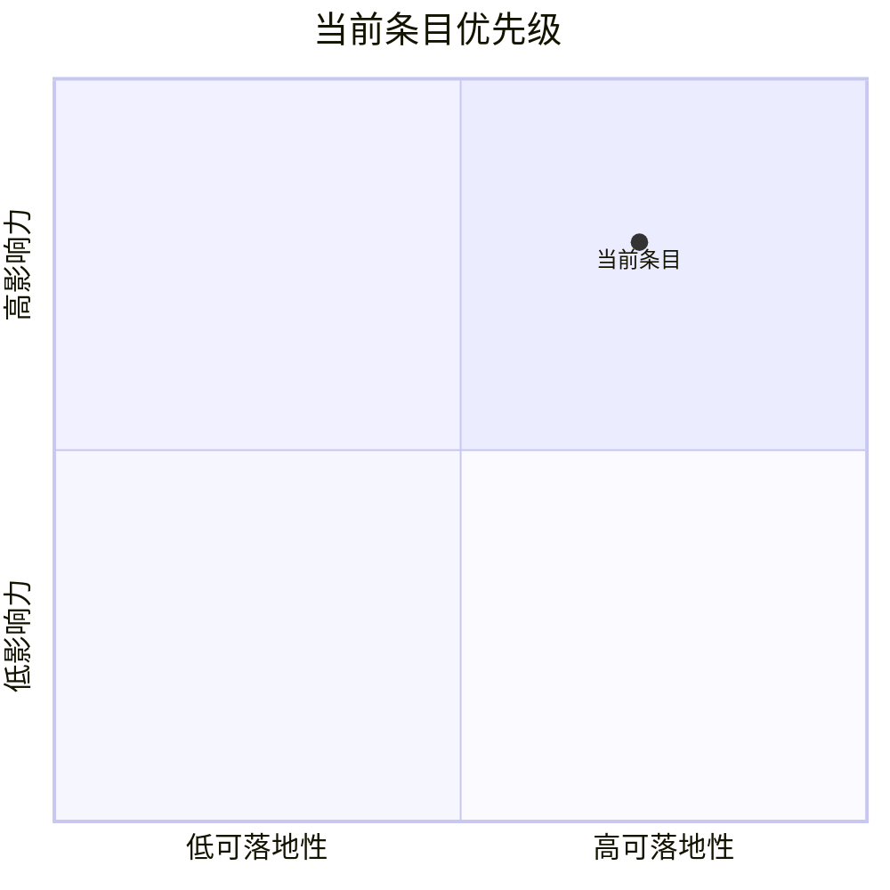

# QwenLM/qwen-code

> 类型：GitHub
> 大类：AI Radar 详情
> 小类：GitHub repo / direct watched fallback
> 推荐等级：可 skim
> 创建日期：2026-08-09
> 原文链接：https://github.com/QwenLM/qwen-code
> 网页详情：https://github.com/dyt27666-oss/AI-news-report-obsidians/blob/main/GitHub/LoopEngineer/2026-08-09/QwenLM__qwen-code.md
> 返回日报：[[Daily/2026-08-09]]

## 一句话结论

Qwen 终端 coding agent；适合国产模型 coding workflow 和 CLI agent 观察。

## TL;DR

- **它是什么**：QwenLM/qwen-code 的今日雷达条目。
- **为什么重要**：该 repo 对今日 AI Infra / coding agent / RL / Point Rummy radar 有可行动观察价值。
- **和我相关的点**：用于 AI Infra / LLM serving / agent loop / RL 训练 / Point Rummy 业务判断。
- **建议动作**：先读原文与元数据；若是 fallback 条目，只作为 watched-source 信号，不当成全网排名。

## 元信息

| 字段 | 内容 |
|---|---|
| 发布方/来源 | QwenLM/qwen-code |
| 栏目/来源类型 | GitHub repo / direct watched fallback |
| 发布时间 | 2026-08-09 |
| 原文 | [原文](https://github.com/QwenLM/qwen-code) |
| 代码 | https://github.com/QwenLM/qwen-code |
| PDF | 未发现 |
| 可信度 | 中 |
| 标签 | #ai-radar |

## 信息压缩图示

### 辅助结构：影响矩阵

| 维度 | 影响 | 建议动作 |
|---|---|---|
| AI Infra | 影响 serving/runtime/training/tooling 判断 | 看原文与 benchmark/docs |
| LLM 工程 | 影响模型接入、上下文、推理或 agent loop | 加入 watchlist |
| RL / Game AI | 若相关，映射到 environment/reward/evaluator | 只保留强相关候选 |
| Agent / Eval | 关注工具调用、MCP、权限、评测闭环 | 小规模试用 |

## 专业解读

Qwen 终端 coding agent；适合国产模型 coding workflow 和 CLI agent 观察。 该 repo 对今日 AI Infra / coding agent / RL / Point Rummy radar 有可行动观察价值。 如果本页来自 direct fallback，则说明它覆盖的是固定 watched repo，不代表完整全网 GitHub 排名；它的价值在于稳定跟踪用户关心的 AI Infra、LLM serving、coding agent loop 或 Point Rummy 业务线。

## 通俗解释

可以把它理解为雷达上的一个固定观测点：不一定是全互联网今天唯一最热，但它和用户的工程/算法工作直接相关，适合持续追踪。

## 关键机制拆解

| 机制 | 解决的问题 | 为什么有效 | 可能的坑 |
|---|---|---|---|
| repo 元数据 | 找到高信号来源 | 保留原文与元数据 | 可能受 API 限流影响 |
| stars / update 信号 | 映射到工程问题 | 对齐 serving/agent/RL 关注点 | 需要二次验证 |
| 试用决策 | 形成行动建议 | 可进入试用/复现/watchlist | 不等于生产就绪 |

## 可信度与局限性

- 证据强度：中。
- 局限性：今日 GitHub Search 大量 403， broad / Loop 榜单采用 direct watched repo fallback。
- 还需要确认：正式 release note、benchmark、docs/examples 或论文全文。

## 我应该如何跟进

1. 打开原文确认 release / README / paper 是否有实质更新。
2. 若和当前工作栈相关，记录最小复现实验或评测脚本。
3. 对低置信来源只加入观察，不进入生产决策。

## 相关链接

- 原文：https://github.com/QwenLM/qwen-code
- 网页详情：https://github.com/dyt27666-oss/AI-news-report-obsidians/blob/main/GitHub/LoopEngineer/2026-08-09/QwenLM__qwen-code.md
- 返回日报：[[Daily/2026-08-09]]

## 标签

#ai-radar #GitHub
