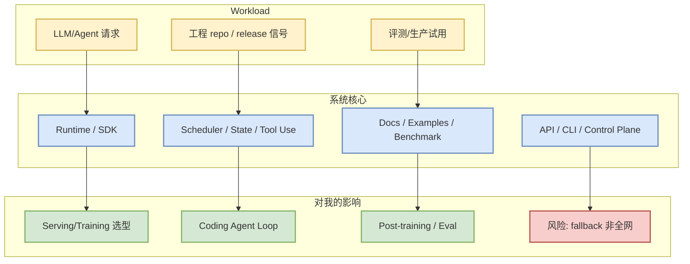

# google-gemini/gemini-cli - AI Radar 详情 (2026-08-10)

## 一句话结论
Gemini 终端 agent；topics 覆盖 MCP client/server，适合观察开放 agent 工具链。

## TL;DR
- 来源：GitHub / direct watched repo fallback（GitHub Search 多数 403 后的保底采集）。
- Stars / Forks：106431 / 14412；语言：TypeScript；更新：2026-08-10T00:58:54Z。
- 今日判断：可 skim，但 growth 标注为“非完整全网日增”。

## 元信息表
| 字段 | 内容 |
|---|---|
| Repo | `google-gemini/gemini-cli` |
| 来源类型 | GitHub Repository / direct watched repo fallback |
| Stars | 106431 |
| Forks | 14412 |
| Language | TypeScript |
| Topics | ai, ai-agents, cli, gemini, gemini-api, mcp-client, mcp-server |
| updated_at | 2026-08-10T00:58:54Z |
| stars_delta | 6 |
| 增长依据 | direct watched repo fallback vs github-stars-2026-08-09.json; 非完整全网日增 |
| 原文链接 | https://github.com/google-gemini/gemini-cli |

## 信息压缩图示

## 影响矩阵
| 维度 | 判断 | 跟进动作 |
|---|---|---|
| AI Infra | 中 | 看 benchmark / examples / issue 热点 |
| Agent workflow | 高 | 观察权限、MCP、上下文和 eval loop |
| 生产可用性 | 中 | 先读 docs，再做最小 PoC |
| 风险 | GitHub Search 403 fallback | 不把 delta 当完整全网增长 |

## 专业解读
Gemini 终端 agent；topics 覆盖 MCP client/server，适合观察开放 agent 工具链。 对用户的价值在于把外部 repo 活跃度映射到 serving、training、post-training、agent loop 的工程决策上。

## 通俗解释
今天不是在说它一定有重大 release，而是在说：在 GitHub Search 被限流时，它仍属于固定 watched set 中最值得盯的基础设施或 coding-agent 项目。

## 可信度与局限性
- 元数据来自 GitHub direct `/repos`，可信度高。
- 排名不是完整 GitHub 全网排名；增长是 watched repo fallback 的非完整日增。

## 我应该如何跟进
1. 打开原 repo，看最近 release / commits / issues。
2. 若涉及 serving：关注 KV cache、batching、硬件适配。
3. 若涉及 coding agent：关注权限模式、上下文窗口、MCP 和 CLI/TUI。

## 相关链接
- 原文：https://github.com/google-gemini/gemini-cli
- Daily：[[Daily/2026-08-10]]

#ai-radar #github #ai-infra #loop-engineering
