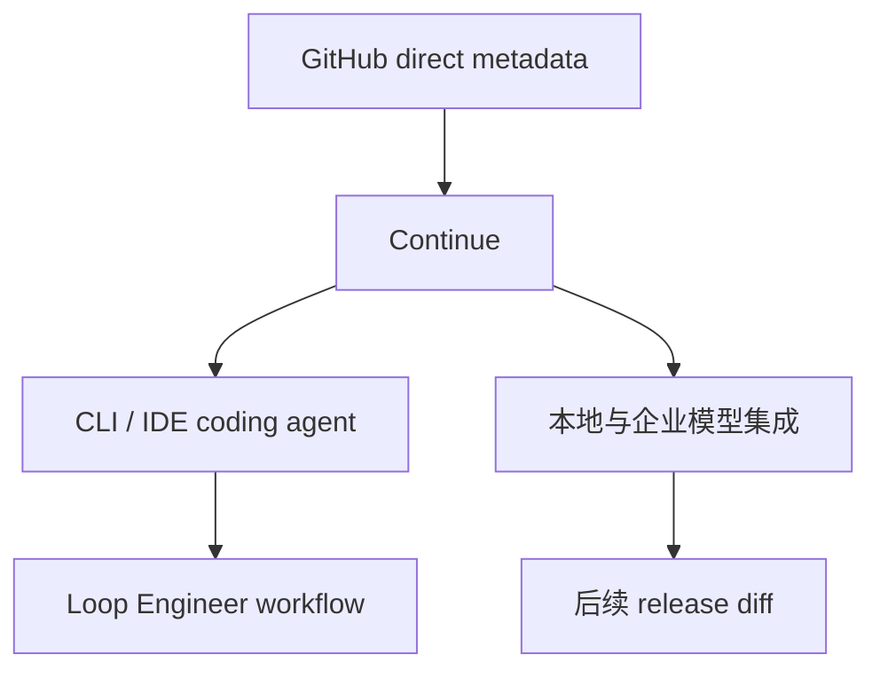

# continuedev/continue

> 日期：2026-08-12
> 来源类型：GitHub Repository / direct watched fallback

## 一句话结论
Continue 是开源 coding agent 观察点；今日 GitHub Search 限流，因此使用 direct watched repo fallback 作为连续监控。

## TL;DR
- 原文：https://github.com/continuedev/continue
- stars / forks：35439 / 5214
- language：TypeScript
- updated_at：2026-08-11T20:52:39Z
- 摘要：open-source coding agent

## 影响矩阵
| 维度 | 判断 |
|---|---|
| Agent Loop | 高 |
| 可信度 | direct /repos 可验证，但非完整全网榜单 |

## 对我的影响
适合观察开源 coding agent 与企业代码库、本地模型、review workflow 的集成方式。

## 相关链接
- 今日日报：[[Daily/2026-08-12]]
- 原文：https://github.com/continuedev/continue

#ai-radar #loop-engineering
