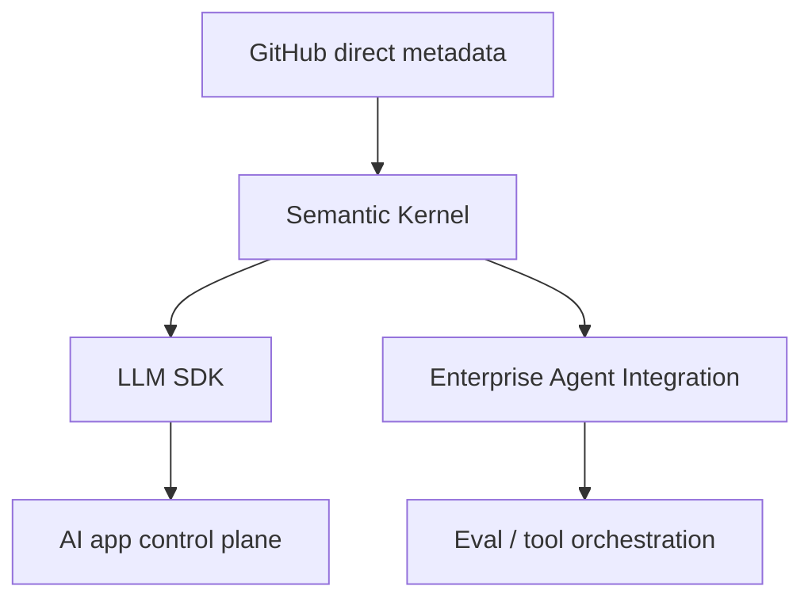

# microsoft/semantic-kernel

> 日期：2026-08-12
> 来源类型：GitHub Repository / direct watched fallback

## 一句话结论
Semantic Kernel 是企业 LLM SDK / agent orchestration 观察点；今日作为 Microsoft 工程信号进入 Loop Engineer 表。

## TL;DR
- 原文：https://github.com/microsoft/semantic-kernel
- stars / forks：28441 / 4713
- language：C#
- updated_at：2026-08-11T18:57:31Z
- 摘要：Integrate cutting-edge LLM technology quickly and easily into your apps

## 影响矩阵
| 维度 | 判断 |
|---|---|
| Agent / SDK | 中高 |
| 可信度 | direct /repos 可验证，但非完整全网榜单 |

## 对我的影响
可用于对比企业级 agent SDK 的插件、tool-use、memory、eval loop 抽象。

## 相关链接
- 今日日报：[[Daily/2026-08-12]]
- 原文：https://github.com/microsoft/semantic-kernel

#ai-radar #loop-engineering
