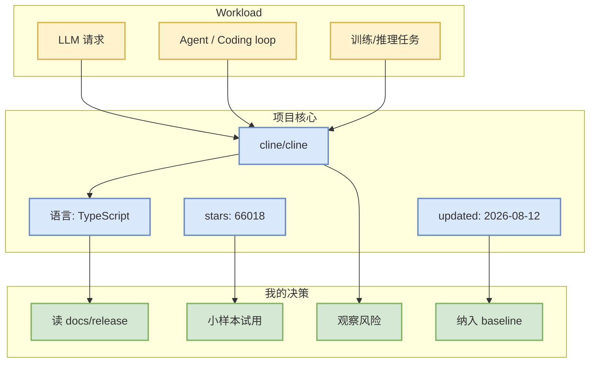

# cline/cline

> 类型：GitHub 项目
> 大类：GitHub
> 小类：LoopEngineer
> 推荐等级：可 skim
> 创建日期：2026-08-13
> 原文链接：https://github.com/cline/cline
> 网页详情：https://github.com/dyt27666-oss/AI-news-report-obsidians/blob/main/GitHub/LoopEngineer/2026-08-13/cline-cline.md
> 返回日报：[[Daily/2026-08-13]]

## 一句话结论

cline/cline 是今日 AI Radar watched-repo fallback 榜单中的高信号项目；今日 GitHub Search 403，因此增长只表示 snapshot/watchlist 范围内的连续性信号。

## TL;DR

- **它是什么**：Autonomous coding agent as an SDK, IDE extension, or CLI assistant.
- **为什么重要**：stars=66018、forks=7091，处在 AI Infra / Agent / LLM 工程生态的关键位置。
- **和我相关的点**：用于判断 serving、训练、agent loop 或 coding-agent 工具链的成熟度。
- **建议动作**：读 docs/release，增长榜前列优先试用。

## 元信息

| 字段 | 内容 |
|---|---|
| repo | cline/cline |
| stars / forks | 66018 / 7091 |
| language | TypeScript |
| updated_at | 2026-08-12T00:54:57Z |
| topics | 未标注 |
| stars_delta | 92 |
| 增长依据 | direct watched repo fallback vs github-stars-2026-08-10.json; 非完整全网日增 |
| 原文 | [GitHub](https://github.com/cline/cline) |

## 信息压缩图示

### 辅助矩阵

| 维度 | 判断 | 下一步 |
|---|---|---|
| 社区成熟度 | 高 | 看 issue/release 活跃度 |
| AI Infra 相关 | 中 | 结合 benchmark/docs |
| Agent Loop 相关 | 强 | 对照当前 coding workflow |

## 专业解读

今日 Search API 被限流，所以这个详情页的定位是“核心 watched repo 连续追踪”。它不替代全网发现，但能保证用户每天都看到关键 AI Infra / coding-agent 依赖的状态变化。对 serving/training 项目，继续关注 scheduler、KV cache、kernel、并行和硬件适配；对 coding-agent 项目，继续关注权限、MCP/插件、远程执行、IDE/CLI 集成和 eval loop。

## 通俗解释

这是一个值得继续盯的项目。即使今天搜索接口失败，直接仓库元数据仍能告诉我们它是否还活跃、社区是否继续增长。

## 关键机制拆解

| 机制 | 解决的问题 | 为什么有效 | 可能的坑 |
|---|---|---|---|
| snapshot 对比 | 观察 star 变化 | 可跨天追踪 | 不是全网增长 |
| direct/fallback 元数据 | 限流时保底 | 来源仍是 GitHub repo | 覆盖范围有限 |
| 主题归类 | 服务用户关注点 | 聚焦 AI Infra/Agent/RL | 可能漏掉新项目 |

## 对我的影响

| 维度 | 影响 | 建议动作 |
|---|---|---|
| AI Infra | 框架成熟度信号 | 看 benchmark/examples |
| LLM 工程 | 可能影响模型接入或 runtime | 关注 release |
| RL / Game AI | 若涉及 RL/post-training，可映射训练框架 | 低成本试用 |
| Agent / Eval | 若涉及 agent，可纳入 loop 工程 | 对照现有工具 |

## 可信度与局限性

- 证据强度：中；元数据可靠，但 Search 403 导致非完整全网榜。
- 局限性：stars_delta 只在历史 snapshot/watchlist 范围内解释。
- 还需要确认：最新 release、benchmark、兼容性。

## 我应该如何跟进

1. 打开 repo release/docs。
2. 对增长榜前 3 小样本试用。
3. 记录对 serving/training/agent loop 的具体影响。

## 相关链接

- 原文：https://github.com/cline/cline
- 网页详情：https://github.com/dyt27666-oss/AI-news-report-obsidians/blob/main/GitHub/LoopEngineer/2026-08-13/cline-cline.md
- 返回日报：[[Daily/2026-08-13]]

## 标签

#ai-radar #github #loopengineer
